# Keuze database

In dit project hebben wij ervoor gekozen om de HAN-database te gebruiken. Deze keuze is gemaakt omdat Luke een deel van het vak Advanced Databases al had afgerond en daardoor de nieuwe opdracht niet hoefde uit te voeren. Daarnaast ondervond hij vorig jaar problemen doordat zijn eigen uitwerking niet volledig aansloot bij de opdracht, waardoor bepaalde constraints en queries niet correct konden worden uitgewerkt. Door gebruik te maken van de standaard HAN-database worden deze risico’s vermeden.

# Bevragingen

## Welke coureurs zijn in alle races van het seizoen 2024 ge-finished?

### Primaire Uitwerking

#### Query

```sql
WITH
    -- The total amount of (inferred) laps for each race in the season of 2024.
    RaceLaps AS (SELECT Race.RaceId      AS RaceId
                      , MAX(Result.Laps) AS Laps
                 FROM Result
                          INNER JOIN Race ON Race.RaceId = Result.RaceId
                 WHERE Race.RaceYear = 2024
                 GROUP BY Race.RaceId),
    -- The amount of laps each driver has completed in each 2024 race.
    DriverLaps AS (SELECT Result.DriverId AS DriverId
                        , Result.RaceId   AS RaceId
                        , Result.Laps     AS Laps
                   FROM Driver
                            INNER JOIN Result ON Result.DriverId = Driver.DriverId
                            INNER JOIN Race ON Race.RaceId = Result.RaceId
                   WHERE Race.RaceYear = 2024),
    -- The amount by which each driver has completed each race (in the range of 0 to 1).
    RaceCompletion AS (SELECT DriverLaps.DriverId                                             AS DriverId
                            , DriverLaps.RaceId                                               AS RaceId
                            , (CAST(DriverLaps.Laps AS FLOAT) / CAST(RaceLaps.Laps AS FLOAT)) AS Completion
                       FROM DriverLaps
                                INNER JOIN RaceLaps ON RaceLaps.RaceId = DriverLaps.RaceId),
    -- The lowest observed completion in all races for each driver.
    MinCompletion AS (SELECT RaceCompletion.DriverId        AS DriverId
                           , MIN(RaceCompletion.Completion) AS MinCompletion
                      FROM RaceCompletion
                      GROUP BY RaceCompletion.DriverId)
-- Select the drivers with (at least) 90% completion for all races, and show their names.
SELECT CONCAT_WS(' ', Driver.Firstname, Driver.Lastname)                         AS Name
     , CONCAT(CAST(ROUND(MinCompletion.MinCompletion, 2) * 100 AS VARCHAR), '%') AS Completion
FROM MinCompletion
         INNER JOIN Driver ON Driver.DriverId = MinCompletion.DriverId
WHERE MinCompletion.MinCompletion >= 0.9
ORDER BY MinCompletion.MinCompletion DESC;
```

#### Resultaten

| Name           | Completion |
|----------------|------------|
| Oscar Piastri  | 100%       |
| Oliver Bearman | 100%       |
| Jack Doohan    | 98%        |
| Liam Lawson    | 95%        |
| Lando Norris   | 90%        |

#### Toelichting

Deze query bepaalt per race in het seizoen 2024 hoeveel ronden er maximaal zijn gereden. 
Dit maximum wordt gebruikt als benadering voor het totaal aantal ronden van die race. 
Daarna wordt per coureur opgehaald hoeveel ronden die coureur in elke race heeft gereden.

Vervolgens berekent de query per coureur en per race het voltooiingspercentage door het aantal 
gereden ronden van de coureur te delen door het maximale aantal ronden van die race. 
Daarna wordt per coureur het laagste voltooiingspercentage over alle races bepaald. 
Dit laagste percentage geeft dus aan hoe goed de coureur het slechtst gepresteerde 
raceweekend heeft voltooid.

In de laatste stap worden alleen coureurs getoond waarvan dit minimum minimaal 90% is. 
Daarmee blijven alleen coureurs over die in elke gereden race van 2024 ten minste 90% van 
de raceafstand hebben afgelegd. De namen worden opgehaald uit de tabel Driver, en het 
percentage wordt afgerond en weergegeven als tekstwaarde.

#### Query plan

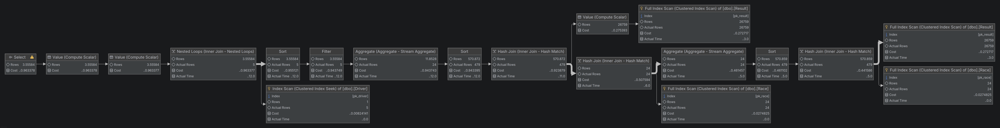

#### Aanbevolen indexen

```sql
create index Result_RaceId_index
    on dbo.Result (RaceId) include (Laps)
go

create index Result_RaceId_index
    on dbo.Result (RaceId) include (DriverId, Laps)
go
```

### Alternatieve Uitwerking

#### Query

```sql
WITH
    -- Determine the completion of each driver per race.
    RaceCompletion
        AS (SELECT CAST(Result.Laps AS FLOAT) / MAX(Result.Laps) OVER (PARTITION BY Race.RaceId) AS Completion
                 , Race.RaceId AS RaceId
                 , Driver.DriverId AS                            DriverId
            FROM Driver
                     INNER JOIN Result ON Result.DriverId = Driver.DriverId
                     INNER JOIN Race ON Race.RaceId = Result.RaceId
            WHERE Race.RaceYear = 2024),
    -- Determine the completion per driver (in the minimum).
    DriverCompletion AS (SELECT MIN(RaceCompletion.Completion) AS MinCompletion
                              , RaceCompletion.DriverId        AS DriverId
                         FROM RaceCompletion
                         GROUP BY RaceCompletion.DriverId)
-- Select only the drivers that have at least 90% completion.
SELECT CONCAT_WS(' ', Driver.Firstname, Driver.Lastname)                            AS Name
     , CONCAT(CAST(ROUND(DriverCompletion.MinCompletion, 2) * 100 AS VARCHAR), '%') AS Completion
FROM DriverCompletion
         INNER JOIN Driver ON Driver.DriverId = DriverCompletion.DriverId
WHERE DriverCompletion.MinCompletion >= 0.9
ORDER BY DriverCompletion.MinCompletion DESC;
```

#### Resultaten

| Name           | Completion |
|----------------|------------|
| Oscar Piastri  | 100%       |
| Oliver Bearman | 100%       |
| Jack Doohan    | 98%        |
| Liam Lawson    | 95%        |
| Lando Norris   | 90%        |

#### Toelichting

Deze alternatieve query voert dezelfde berekening compacter uit. In plaats van eerst in een aparte 
CTE het maximale aantal ronden per race te bepalen, gebruikt deze query een window function: 
`MAX(Result.Laps) OVER (PARTITION BY Race.RaceId)`. Daarmee wordt per race direct het maximale 
aantal gereden ronden bepaald, zonder dat hiervoor een aparte aggregatie en join nodig is.

Per resultaatregel wordt vervolgens berekend welk deel van de raceafstand de coureur heeft voltooid. 
Daarna wordt per coureur opnieuw het laagste voltooiingspercentage over alle races bepaald met 
`MIN(Completion)`. Dit minimum geeft aan wat de laagste racevoltooiing van de coureur in 2024 was.

Tot slot filtert de query op coureurs met een minimale voltooiing van 90% of hoger. Het 
eindresultaat is daardoor gelijk aan de primaire uitwerking, maar de query is korter doordat de 
raceafstand via een window function binnen dezelfde tussenstap wordt berekend.

#### Query plan

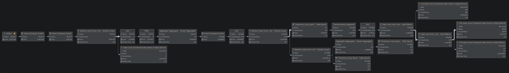

#### Aanbevolen indexen

```sql
create index Result_RaceId_index
    on dbo.Result (RaceId) include (DriverId, Laps)
go
```

### Alternatieve Uitwerking 2

#### Query

```sql
SELECT CONCAT_WS(' ', d.Firstname, d.Lastname)                         AS Name
     , CONCAT(CAST(ROUND(MIN(CAST(r.Laps AS FLOAT) / rml.MaxLaps), 2) * 100 AS VARCHAR), '%') AS Completion
FROM Result r
         INNER JOIN Race ON Race.RaceId = r.RaceId
         INNER JOIN (SELECT Result.RaceId      AS RaceId
                          , MAX(Result.Laps) AS MaxLaps
                     FROM Result
                              INNER JOIN Race ON Race.RaceId = Result.RaceId
                     WHERE Race.RaceYear = 2024
                     GROUP BY Result.RaceId) rml ON rml.RaceId = r.RaceId
         INNER JOIN Driver d ON d.DriverId = r.DriverId
WHERE Race.RaceYear = 2024
GROUP BY d.DriverId, d.Firstname, d.Lastname
HAVING MIN(CAST(r.Laps AS FLOAT) / rml.MaxLaps) >= 0.9
ORDER BY MIN(CAST(r.Laps AS FLOAT) / rml.MaxLaps) DESC;
```

#### Resultaten

| Name           | Completion |
|----------------|------------|
| Oscar Piastri  | 100%       |
| Oliver Bearman | 100%       |
| Jack Doohan    | 98%        |
| Liam Lawson    | 95%        |
| Lando Norris   | 90%        |

#### Toelichting

Deze derde variant gebruikt een derived table in plaats van CTE's. Binnen de FROM-clausule wordt eerst per race het maximale aantal ronden bepaald met een subquery (`rml`). Deze wordt direct gekoppeld aan de Result-tabel, waardoor het voltooiingspercentage per coureur per race kan worden berekend.

In tegenstelling tot de eerdere implementaties wordt de aggregatie volledig in de hoofdquery uitgevoerd met een `GROUP BY` op coureur. Het laagste voltooiingspercentage per coureur wordt berekend via `MIN(CAST(r.Laps AS FLOAT) / rml.MaxLaps)`. De filtering op minimaal 90% gebeurt hier in de `HAVING`-clausule in plaats van in een `WHERE`. Deze aanpak is compacter maar combineert aggregatie en filtering in één stap.

#### Query plan

#### Aanbevolen indexen

### Vergelijking

Hoewel beide query-plannen redelijk op elkaar lijken, is een van de eerste dingen die mij wel opvalt dat de alternatieve
implementatie twee keer de Driver tabel raadpleegt, waarvan de eerste een *Index Scan* is en de tweede een *Index Seek*.
De primaire implementatie daarentegen, voert enkel de laatste operation uit, namelijk de *Index Seek*. Dit is veel
efficiënter omdat enkel in het laatste stadium de relevante drivers op worden gehaald.

Een van de andere dingen die opvalt, is dat de alternatieve implementatie veel *Spooling* heeft, namelijk 3 operators
in totaal. Dit is op zich best logisch, want dit komt vaak voor als *Nested Loops* joins gebruikt worden, wat hier het 
geval is; deze hebben namelijk als doel om te voorkomen dat data meerdere keren opnieuw wordt gelezen. Dit is helaas
niet direct goed nieuws, want ze kunnen mogelijk veel extra geheugen gebruiken, en soms zelfs ook zorgen voor disk IO.
In dit geval is dat niet zozeer zorgelijk, want de daadwerkelijke aantallen van rijen vallen best mee, maar nog steeds
heb je liever geen spooling.

Buiten deze twee stukken om valt er niet enorm veel op aan de queries, andere operators als sorting en filtering
zijn best vergelijkbaar, al bevinden ze zich op andere stukken in het plan. Deze voorgaande twee inzichten zijn dus
de dingen die direct opvallen bij het vergelijken van deze twee query-plannen.

### Voorkeur

Gezien het feit dat de primaire implementatie de Driver tabel efficiënter raadpleegt, en daarnaast geen spooling 
gebruikt, heeft deze onze voorkeur. Ook als we naar stijl kijken, heeft de primaire de voorkeur, deze breekt het
proces namelijk op in duidelijkere stappen, in plaats van het proberen samen te voegen van meerdere stappen; wel moet
er nog worden opgemerkt dat de tweede wel compacter is, wat voor sommige de voorkeur kan hebben.

## Van 2004 tot en met 2024: per race de snelste ronde met circuit, racedatum, coureur, rondenummer, rondetijd, positie, punten, totaal aantal rondes en resultstatus; gesorteerd op circuit en daarna op rondetijd.

### Primaire Uitwerking

#### Query

```sql
WITH FastestRaceResult
         AS (SELECT (SELECT TOP 1 Result.ResultId
                     FROM Result
                     WHERE Result.RaceId = Race.RaceId
                       AND Result.FastestLapTime IS NOT NULL
                     ORDER BY Result.FastestLapTime) AS FastestResultId
                  , Race.RaceId                      AS RaceId
             FROM Race
             WHERE Race.RaceYear BETWEEN 2004 AND 2024)
SELECT Circuit.CircuitName                               AS CircuitName
     , Race.RaceDate                                     AS RaceDate
     , CONCAT_WS(' ', Driver.Firstname, Driver.Lastname) AS Name
     , Result.FastestLap                                 AS FastestLap
     , Result.FastestLapTime                             AS FastestLapTime
     , Result.PositionText AS Position
     , Result.Points                                     AS Points
     , Result.Laps                                       AS Laps
     , ResultStatus.ResultStatus                         AS ResultStatus
FROM FastestRaceResult
    INNER JOIN Race
ON Race.RaceId = FastestRaceResult.RaceId
    INNER JOIN Result ON Result.ResultId = FastestRaceResult.FastestResultId
    INNER JOIN Driver ON Driver.DriverId = Result.DriverId
    INNER JOIN Circuit ON Circuit.CircuitId = Race.CircuitId
    INNER JOIN ResultStatus ON ResultStatus.ResultStatusId = Result.ResultStatusId
ORDER BY CircuitName, FastestLapTime;
```

#### Resultaten

| CircuitName                    | RaceDate   | Name               | FastestLap | FastestLapTime   | Position | Points  | Laps | ResultStatus |
|--------------------------------|------------|--------------------|------------|------------------|----------|---------|------|--------------|
| Albert Park Grand Prix Circuit | 2024-03-24 | Charles Leclerc    | 56         | 00:01:19.8130000 | 2        | 19.0000 | 58   | Finished     |
| Albert Park Grand Prix Circuit | 2023-04-02 | Sergio Pérez       | 53         | 00:01:20.2350000 | 5        | 11.0000 | 58   | Finished     |
| Albert Park Grand Prix Circuit | 2022-04-10 | Charles Leclerc    | 58         | 00:01:20.2600000 | 1        | 26.0000 | 58   | Finished     |
| Albert Park Grand Prix Circuit | 2004-03-07 | Michael Schumacher | 29         | 00:01:24.1250000 | 1        | 10.0000 | 58   | Finished     |
| Albert Park Grand Prix Circuit | 2007-03-18 | Kimi Räikkönen     | 41         | 00:01:25.2350000 | 1        | 10.0000 | 58   | Finished     |
| Albert Park Grand Prix Circuit | 2019-03-17 | Valtteri Bottas    | 57         | 00:01:25.5800000 | 1        | 26.0000 | 58   | Finished     |
| Albert Park Grand Prix Circuit | 2005-03-06 | Fernando Alonso    | 24         | 00:01:25.6830000 | 3        | 6.0000  | 57   | Finished     |
| Albert Park Grand Prix Circuit | 2018-03-25 | Daniel Ricciardo   | 54         | 00:01:25.9450000 | 4        | 12.0000 | 58   | Finished     |
| Albert Park Grand Prix Circuit | 2006-04-02 | Kimi Räikkönen     | 57         | 00:01:26.0450000 | 2        | 8.0000  | 57   | Finished     |
| Albert Park Grand Prix Circuit | 2017-03-26 | Kimi Räikkönen     | 56         | 00:01:26.5380000 | 4        | 12.0000 | 57   | Finished     |
| Albert Park Grand Prix Circuit | 2008-03-16 | Heikki Kovalainen  | 43         | 00:01:27.4180000 | 5        | 4.0000  | 58   | Finished     |
| Albert Park Grand Prix Circuit | 2009-03-29 | Nico Rosberg       | 48         | 00:01:27.7060000 | 6        | 3.0000  | 58   | Finished     |
| Albert Park Grand Prix Circuit | 2010-03-28 | Mark Webber        | 47         | 00:01:28.3580000 | 9        | 2.0000  | 58   | Finished     |
| Albert Park Grand Prix Circuit | 2011-03-27 | Felipe Massa       | 55         | 00:01:28.9470000 | 7        | 6.0000  | 58   | Finished     |
| Albert Park Grand Prix Circuit | 2016-03-20 | Daniel Ricciardo   | 49         | 00:01:28.9970000 | 4        | 12.0000 | 57   | Finished     |
| Albert Park Grand Prix Circuit | 2012-03-18 | Jenson Button      | 56         | 00:01:29.1870000 | 1        | 25.0000 | 58   | Finished     |
| ...                            | ...        | ...                | ...        | ...              | ...      | ...     | ...  | ...          | 

#### Toelichting

Deze query zoekt per race tussen 2004 en 2024 de snelste rondetijd. In de CTE FastestRaceResult wordt voor elke race 
met een subquery het ResultId opgehaald van het resultaat met de laagste FastestLapTime. Resultaten zonder snelste 
rondetijd worden hierbij uitgesloten.

Daarna wordt dit snelste resultaat gekoppeld aan de tabellen Race, Driver, Circuit en ResultStatus. Hierdoor kan de 
query naast de snelste rondetijd ook extra informatie tonen, zoals het circuit, de racedatum, de coureur, het 
rondenummer, de eindpositie, punten, het totaal aantal gereden rondes en de resultstatus.

Tot slot wordt het resultaat gesorteerd op circuitnaam en daarna op rondetijd. Daardoor staan de snelste rondes per 
circuit gegroepeerd, met binnen elk circuit de snelste tijden bovenaan.

#### Query plan

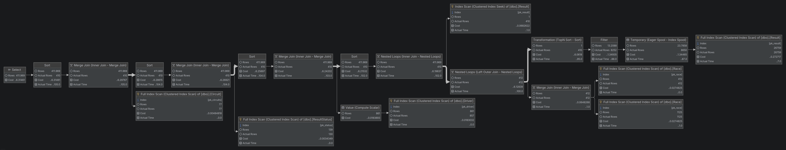

#### Aanbevolen indexen

Er zijn geen indexen voorgesteld door de database management tool voor deze query.

### Alternatieve Uitwerking

#### Query

```sql
WITH RankedResults
         AS (SELECT r.RaceId
                  , res.ResultId
                  , res.DriverId
                  , res.FastestLap
                  , res.FastestLapTime
                  , res.PositionText
                  , res.Points
                  , res.Laps
                  , res.ResultStatusId
                  , ROW_NUMBER() OVER (PARTITION BY r.RaceId ORDER BY res.FastestLapTime) AS rn
             FROM Race r
                      INNER JOIN Result res
                                 ON res.RaceId = r.RaceId
             WHERE r.RaceYear BETWEEN 2004 AND 2024
               AND res.FastestLapTime IS NOT NULL)

SELECT c.CircuitName                           AS CircuitName
     , r.RaceDate                              AS RaceDate
     , CONCAT_WS(' ', d.Firstname, d.Lastname) AS Name
     , rr.FastestLap                           AS FastestLap
     , rr.FastestLapTime                       AS FastestLapTime
     , rr.PositionText AS Position
     , rr.Points                               AS Points
     , rr.Laps                                 AS Laps
     , rs.ResultStatus                         AS ResultStatus
FROM RankedResults rr
    INNER JOIN Race r
ON r.RaceId = rr.RaceId
    INNER JOIN Driver d
    ON d.DriverId = rr.DriverId
    INNER JOIN Circuit c
    ON c.CircuitId = r.CircuitId
    INNER JOIN ResultStatus rs
    ON rs.ResultStatusId = rr.ResultStatusId
WHERE rr.rn = 1
ORDER BY CircuitName, FastestLapTime;
```

#### Resultaten

| CircuitName                    | RaceDate   | Name               | FastestLap | FastestLapTime   | Position | Points  | Laps | ResultStatus |
|--------------------------------|------------|--------------------|------------|------------------|----------|---------|------|--------------|
| Albert Park Grand Prix Circuit | 2024-03-24 | Charles Leclerc    | 56         | 00:01:19.8130000 | 2        | 19.0000 | 58   | Finished     |
| Albert Park Grand Prix Circuit | 2023-04-02 | Sergio Pérez       | 53         | 00:01:20.2350000 | 5        | 11.0000 | 58   | Finished     |
| Albert Park Grand Prix Circuit | 2022-04-10 | Charles Leclerc    | 58         | 00:01:20.2600000 | 1        | 26.0000 | 58   | Finished     |
| Albert Park Grand Prix Circuit | 2004-03-07 | Michael Schumacher | 29         | 00:01:24.1250000 | 1        | 10.0000 | 58   | Finished     |
| Albert Park Grand Prix Circuit | 2007-03-18 | Kimi Räikkönen     | 41         | 00:01:25.2350000 | 1        | 10.0000 | 58   | Finished     |
| Albert Park Grand Prix Circuit | 2019-03-17 | Valtteri Bottas    | 57         | 00:01:25.5800000 | 1        | 26.0000 | 58   | Finished     |
| Albert Park Grand Prix Circuit | 2005-03-06 | Fernando Alonso    | 24         | 00:01:25.6830000 | 3        | 6.0000  | 57   | Finished     |
| Albert Park Grand Prix Circuit | 2018-03-25 | Daniel Ricciardo   | 54         | 00:01:25.9450000 | 4        | 12.0000 | 58   | Finished     |
| Albert Park Grand Prix Circuit | 2006-04-02 | Kimi Räikkönen     | 57         | 00:01:26.0450000 | 2        | 8.0000  | 57   | Finished     |
| Albert Park Grand Prix Circuit | 2017-03-26 | Kimi Räikkönen     | 56         | 00:01:26.5380000 | 4        | 12.0000 | 57   | Finished     |
| Albert Park Grand Prix Circuit | 2008-03-16 | Heikki Kovalainen  | 43         | 00:01:27.4180000 | 5        | 4.0000  | 58   | Finished     |
| Albert Park Grand Prix Circuit | 2009-03-29 | Nico Rosberg       | 48         | 00:01:27.7060000 | 6        | 3.0000  | 58   | Finished     |
| Albert Park Grand Prix Circuit | 2010-03-28 | Mark Webber        | 47         | 00:01:28.3580000 | 9        | 2.0000  | 58   | Finished     |
| Albert Park Grand Prix Circuit | 2011-03-27 | Felipe Massa       | 55         | 00:01:28.9470000 | 7        | 6.0000  | 58   | Finished     |
| Albert Park Grand Prix Circuit | 2016-03-20 | Daniel Ricciardo   | 49         | 00:01:28.9970000 | 4        | 12.0000 | 57   | Finished     |
| Albert Park Grand Prix Circuit | 2012-03-18 | Jenson Button      | 56         | 00:01:29.1870000 | 1        | 25.0000 | 58   | Finished     |
| ...                            | ...        | ...                | ...        | ...              | ...      | ...     | ...  | ...          | 

#### Toelichting

Deze alternatieve query gebruikt een window function om per race de snelste ronde te bepalen. In de CTE RankedResults 
krijgen alle resultaten met een ingevulde FastestLapTime een rangnummer per race via `ROW_NUMBER() OVER (PARTITION 
BY r.RaceId ORDER BY res.FastestLapTime)`. Het resultaat met rangnummer 1 is dus de snelste ronde van die race.

In de hoofdquery worden alleen de regels met rn = 1 geselecteerd. Daarna worden deze gekoppeld aan de tabellen Race, 
Driver, Circuit en ResultStatus, zodat alle gevraagde gegevens kunnen worden weergegeven.

Deze aanpak levert hetzelfde resultaat op als de primaire uitwerking, maar is vaak overzichtelijker omdat de 
selectie van de snelste ronde expliciet via rangschikking gebeurt. Ook sluit deze vorm goed aan op de aanbevolen 
indexen, omdat er per race wordt geordend op FastestLapTime.

#### Query plan

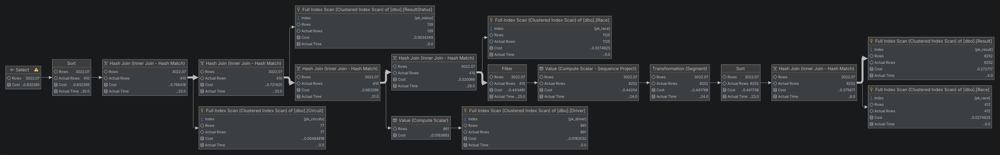

#### Aanbevolen indexen

```sql
create index Result_FastestLapTime_index
    on dbo.Result (FastestLapTime) include (RaceId, DriverId, PositionText, Points, Laps, FastestLap, ResultStatusId)
go

create index Result_RaceId_FastestLapTime_index
    on dbo.Result (RaceId, FastestLapTime) include (DriverId, PositionText, Points, Laps, FastestLap, ResultStatusId)
go
```

### Alternatieve Uitwerking 2

#### Query

```sql
WITH FastestPerRace
         AS (SELECT Result.RaceId             AS RaceId
                  , MIN(Result.FastestLapTime) AS MinTime
             FROM Result
             WHERE Result.FastestLapTime IS NOT NULL
             GROUP BY Result.RaceId)
SELECT Circuit.CircuitName                               AS CircuitName
     , Race.RaceDate                                     AS RaceDate
     , CONCAT_WS(' ', Driver.Firstname, Driver.Lastname) AS Name
     , Result.FastestLap                                 AS FastestLap
     , Result.FastestLapTime                             AS FastestLapTime
     , Result.PositionText                               AS Position
     , Result.Points                                     AS Points
     , Result.Laps                                       AS Laps
     , ResultStatus.ResultStatus                         AS ResultStatus
FROM FastestPerRace
         INNER JOIN Result ON Result.RaceId = FastestPerRace.RaceId
             AND Result.FastestLapTime = FastestPerRace.MinTime
         INNER JOIN Race ON Race.RaceId = FastestPerRace.RaceId
         INNER JOIN Driver ON Driver.DriverId = Result.DriverId
         INNER JOIN Circuit ON Circuit.CircuitId = Race.CircuitId
         INNER JOIN ResultStatus ON ResultStatus.ResultStatusId = Result.ResultStatusId
WHERE Race.RaceYear BETWEEN 2004 AND 2024
ORDER BY CircuitName, FastestLapTime;
```

#### Resultaten

| CircuitName                    | RaceDate   | Name               | FastestLap | FastestLapTime   | Position | Points  | Laps | ResultStatus |
|--------------------------------|------------|--------------------|------------|------------------|----------|---------|------|--------------|
| Albert Park Grand Prix Circuit | 2024-03-24 | Charles Leclerc    | 56         | 00:01:19.8130000 | 2        | 19.0000 | 58   | Finished     |
| Albert Park Grand Prix Circuit | 2023-04-02 | Sergio Perez       | 53         | 00:01:20.2350000 | 5        | 11.0000 | 58   | Finished     |
| Albert Park Grand Prix Circuit | 2022-04-10 | Charles Leclerc    | 58         | 00:01:20.2600000 | 1        | 26.0000 | 58   | Finished     |
| Albert Park Grand Prix Circuit | 2004-03-07 | Michael Schumacher | 29         | 00:01:24.1250000 | 1        | 10.0000 | 58   | Finished     |
| ...                            | ...        | ...                | ...        | ...              | ...      | ...     | ...  | ...          |

#### Toelichting

Deze derde variant bepaalt eerst per race de snelste rondetijd via `MIN(Result.FastestLapTime) GROUP BY Result.RaceId`. De CTE `FastestPerRace` bevat dus per race de minimale rondetijd, die vervolgens via een join op zowel `RaceId` als `FastestLapTime` weer aan de Result-tabel wordt gekoppeld om de bijbehorende volledige resultaatregel op te halen.

Deze aanpak is compacter dan de primaire implementatie (geen geneste subquery per race) en vermijdt het gebruik van window functions zoals de eerste alternatieve implementatie. Let op: indien meerdere coureurs exact dezelfde snelste rondetijd hebben, toont deze query beide resultaten. In de praktijk komt dit echter zelden voor.

#### Query plan

#### Aanbevolen indexen

### Vergelijking

Een van de eerste dingen die op opvalt in de queryplannen is dat deze keer de primaire implementatie gebruikt
maakt van spooling. In de eerste bevraging was spooling ook behandeld, maar daarbij was het aantal gelezen
rijen niet heel significant, ook al was het wel iets waar op gelet moest worden. Deze query heeft echter wel
een enorm groot aantal rijen, namelijk bijna 9000. Dit kan erg veel geheugen kosten, en veel IO als het op
de disk opgeslagen wordt. Dit is dus al eigenlijk iets dat wij niet willen zien.

Verder wordt er in de primaire implementatie veel gebruik gemaakt van *Nested Loops*, die ieder best een
grote cost hebben. De alternatieve implementatie maakt in contrast gebruik van normale *Hash Joins*, die veel
lagere kosten hebben, en ook beter zijn voor de performance in grote aantallen. De *Merge Join* van de
primaire implementatie is daarintegen niet zorgwekkend, deze operation wordt direct gebaseerd op de inhoud
van de clustered index, die al gesorteerd is, waardoor geen dure sort-operation nodig is.

Een ander iets dat opvalt is dat de primaire implementatie meer *Full Index Scan* operators gebruikt
dan de alternatieve implementatie, waarbij zowel de Race als Result tabellen twee keer worden raadgepleegd.
De alternatieve implementatie doet dit minder, met enkel de Race die twee keer wordt raadgepleegd.

### Voorkeur

De voorkeur van ons is zoals te verwachten, voor de alternatieve implementatie. Deze maakt gebruik van snelle
en goedkope *Hash Join* operators, raadpleegt indexen minder vaak (minder IO) en heeft geen *Spooling* operators. Daarnaast is het queryplan van de alternatieve implementatie veel simpeler, en is de cost/
executietijd lager. Kijkend naar de code-style, is hierbij niet echt een voorkeur te benoemen, beide queries
zijn van vergelijkbare leesbaarheid en complexiteit.

## Toon voor de seizoenen 2015 tot en met 2024 de winnaar van het seizoen. Geef het jaartal van het seizoen, de naam van de winnaar, het aantal races dat hij heeft gewonnen. Voeg ook het totaal aantal races toe, en voeg tot slot het volgende toe: vanaf welke race (datum, volgnummer in het seizoen + naam van de race) stond hij in de klassering op de eerste plaats en behield hij die eerste plek tot het einde toe.

### Primaire Uitwerking

#### Query

```sql
WITH SeasonWinner
         AS (SELECT Race.RaceYear
                  , DriverStanding.DriverId
                  , CONCAT_WS(' ', Driver.Firstname, Driver.Lastname) AS DriverName
             FROM DriverStanding
                      INNER JOIN Race ON Race.RaceId = DriverStanding.RaceId
                      INNER JOIN Driver ON Driver.DriverId = DriverStanding.DriverId
             WHERE DriverStanding.Position = 1
               AND Race.RaceYear BETWEEN 2015 AND 2024
               AND Race.NrOfRound =
                   (SELECT MAX(Race2.NrOfRound) FROM Race Race2 WHERE Race2.RaceYear = Race.RaceYear)),
     ChampStandings
         AS (SELECT Race.RaceYear
                  , Race.RaceId
                  , Race.RaceDate
                  , Race.NrOfRound
                  , Race.RaceName
                  , DriverStanding.Position AS StandPos
                  , ROW_NUMBER()               OVER (PARTITION BY Race.RaceYear ORDER BY Race.NrOfRound) AS Seq
             FROM DriverStanding
                      INNER JOIN Race ON Race.RaceId = DriverStanding.RaceId
                      INNER JOIN SeasonWinner ON SeasonWinner.DriverId = DriverStanding.DriverId AND
                                                 SeasonWinner.RaceYear = Race.RaceYear),
     FirstUnbrokenP1
         AS (SELECT RaceYear
                  , MIN(CASE WHEN StandPos = 1 THEN Seq END) AS FirstSeq
             FROM ChampStandings
             WHERE Seq > COALESCE((SELECT MAX(ChampStandings2.Seq)
                                   FROM ChampStandings AS ChampStandings2
                                   WHERE ChampStandings2.RaceYear = ChampStandings.RaceYear
                                     AND ChampStandings2.StandPos > 1), 0)
             GROUP BY RaceYear),
     SeasonTotals
         AS (SELECT RaceYear
                  , COUNT(*) AS TotaalRaces
             FROM Race
             WHERE RaceYear BETWEEN 2015 AND 2024
             GROUP BY RaceYear),
     ChampWins
         AS (SELECT Race.RaceYear
                  , COUNT(*) AS RaceWins
             FROM Result
                      INNER JOIN Race ON Race.RaceId = Result.RaceId
                      INNER JOIN SeasonWinner
                                 ON SeasonWinner.DriverId = Result.DriverId AND
                                    SeasonWinner.RaceYear = Race.RaceYear
             WHERE Result.Position = 1
             GROUP BY Race.RaceYear)

SELECT SeasonWinner.RaceYear    AS Seizoen
     , SeasonWinner.DriverName  AS Kampioen
     , ChampWins.RaceWins       AS RaceWins
     , SeasonTotals.TotaalRaces AS TotaalRaces
     , ChampStandings.RaceDate  AS LeiderVanaf
     , ChampStandings.NrOfRound AS Volgnummer
     , ChampStandings.RaceName  AS Race
FROM SeasonWinner
         JOIN ChampWins ON ChampWins.RaceYear = SeasonWinner.RaceYear
         JOIN SeasonTotals ON SeasonTotals.RaceYear = SeasonWinner.RaceYear
         JOIN FirstUnbrokenP1 ON FirstUnbrokenP1.RaceYear = SeasonWinner.RaceYear
         JOIN ChampStandings
              ON ChampStandings.RaceYear = SeasonWinner.RaceYear AND ChampStandings.Seq = FirstUnbrokenP1.FirstSeq
ORDER BY SeasonWinner.RaceYear;
```

#### Resultaten

| Seizoen | Kampioen       | RaceWins | TotaalRaces | LeiderVanaf | Volgnummer | Race                  |
|---------|----------------|----------|-------------|-------------|------------|-----------------------|
| 2015    | Lewis Hamilton | 10       | 19          | 2015-03-15  | 1          | Australian Grand Prix |
| 2016    | Nico Rosberg   | 9        | 21          | 2016-09-18  | 15         | Singapore Grand Prix  |
| 2017    | Lewis Hamilton | 9        | 20          | 2017-09-03  | 13         | Italian Grand Prix    |
| 2018    | Lewis Hamilton | 11       | 21          | 2018-07-22  | 11         | German Grand Prix     |
| 2019    | Lewis Hamilton | 11       | 21          | 2019-05-12  | 5          | Spanish Grand Prix    |
| 2020    | Lewis Hamilton | 11       | 17          | 2020-07-19  | 3          | Hungarian Grand Prix  |
| 2021    | Max Verstappen | 10       | 22          | 2021-10-10  | 16         | Turkish Grand Prix    |
| 2022    | Max Verstappen | 15       | 22          | 2022-05-22  | 6          | Spanish Grand Prix    |
| 2023    | Max Verstappen | 19       | 22          | 2023-03-05  | 1          | Bahrain Grand Prix    |
| 2024    | Max Verstappen | 9        | 24          | 2024-03-02  | 1          | Bahrain Grand Prix    |

#### Toelichting

Deze query bepaalt per seizoen tussen 2015 en 2024 wie aan het einde van het seizoen bovenaan stond in de 
coureursstand. Dit gebeurt in SeasonWinner, waar per seizoen wordt gekeken naar de laatste race van dat jaar en de 
coureur met positie 1 in de stand.

Daarna wordt voor deze kampioen per race opgehaald welke positie hij na elke race in de stand had. Met FirstUnbrokenP1 
wordt bepaald vanaf welk moment de kampioen op positie 1 stond en daarna niet meer van die eerste plek is afgeweken. 
Dit gebeurt door te zoeken naar de eerste race ná de laatste keer dat de kampioen lager dan eerste stond.

Daarnaast berekent de query het totaal aantal races in het seizoen en het aantal races dat de kampioen daadwerkelijk 
heeft gewonnen. In het eindresultaat worden deze gegevens gecombineerd met de datum, het volgnummer en de naam van de 
race vanaf waar de kampioen de leiding definitief behield.

#### Query plan

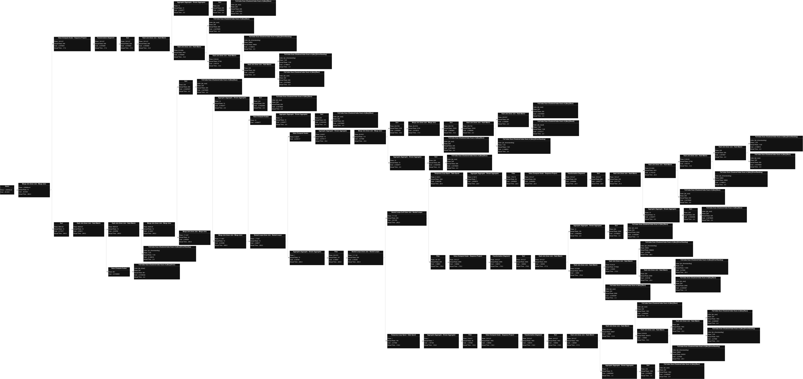

#### Aanbevolen indexen

Er zijn geen indexen voorgesteld door de database management tool voor deze query.

### Alternatieve Uitwerking

#### Query

```sql
WITH SeasonWinner
         AS (SELECT Race.RaceYear
                  , DriverStanding.DriverId
                  , CONCAT_WS(' ', Driver.Firstname, Driver.Lastname) AS DriverName
             FROM DriverStanding
                      INNER JOIN Race ON Race.RaceId = DriverStanding.RaceId
                      INNER JOIN Driver ON Driver.DriverId = DriverStanding.DriverId
             WHERE DriverStanding.Position = 1
               AND Race.RaceYear BETWEEN 2015 AND 2024
               AND Race.NrOfRound =
                   (SELECT MAX(Race2.NrOfRound)
                    FROM Race Race2
                    WHERE Race2.RaceYear = Race.RaceYear))

SELECT SeasonWinner.RaceYear     AS Seizoen
     , SeasonWinner.DriverName   AS Kampioen
     , RaceWins.RaceWins         AS RaceWins
     , SeasonTotals.TotaalRaces  AS TotaalRaces
     , FirstUnbrokenP1.RaceDate  AS LeiderVanaf
     , FirstUnbrokenP1.NrOfRound AS Volgnummer
     , FirstUnbrokenP1.RaceName  AS Race
FROM SeasonWinner
    CROSS APPLY (SELECT COUNT(*) AS TotaalRaces
                      FROM Race
                      WHERE Race.RaceYear = SeasonWinner.RaceYear) AS SeasonTotals
         CROSS APPLY (SELECT COUNT(*) AS RaceWins
                      FROM Result
                               INNER JOIN Race ON Race.RaceId = Result.RaceId
                      WHERE Result.DriverId = SeasonWinner.DriverId
                        AND Race.RaceYear = SeasonWinner.RaceYear
                        AND Result.Position = 1) AS RaceWins
         CROSS APPLY (SELECT TOP 1 Race.RaceDate
                                 , Race.NrOfRound
                                 , Race.RaceName
                      FROM DriverStanding
                               INNER JOIN Race ON Race.RaceId = DriverStanding.RaceId
                      WHERE DriverStanding.DriverId = SeasonWinner.DriverId
                        AND Race.RaceYear = SeasonWinner.RaceYear
                        AND DriverStanding.Position = 1
                        AND NOT EXISTS (SELECT 1
                                        FROM DriverStanding DS2
                                                 INNER JOIN Race Race2 ON Race2.RaceId = DS2.RaceId
                                        WHERE DS2.DriverId = SeasonWinner.DriverId
                                          AND Race2.RaceYear = SeasonWinner.RaceYear
                                          AND DS2.Position > 1
                                          AND Race2.NrOfRound > Race.NrOfRound)
                      ORDER BY Race.NrOfRound) AS FirstUnbrokenP1
ORDER BY SeasonWinner.RaceYear;
```

#### Resultaten

| Seizoen | Kampioen       | RaceWins | TotaalRaces | LeiderVanaf | Volgnummer | Race                  |
|---------|----------------|----------|-------------|-------------|------------|-----------------------|
| 2015    | Lewis Hamilton | 10       | 19          | 2015-03-15  | 1          | Australian Grand Prix |
| 2016    | Nico Rosberg   | 9        | 21          | 2016-09-18  | 15         | Singapore Grand Prix  |
| 2017    | Lewis Hamilton | 9        | 20          | 2017-09-03  | 13         | Italian Grand Prix    |
| 2018    | Lewis Hamilton | 11       | 21          | 2018-07-22  | 11         | German Grand Prix     |
| 2019    | Lewis Hamilton | 11       | 21          | 2019-05-12  | 5          | Spanish Grand Prix    |
| 2020    | Lewis Hamilton | 11       | 17          | 2020-07-19  | 3          | Hungarian Grand Prix  |
| 2021    | Max Verstappen | 10       | 22          | 2021-10-10  | 16         | Turkish Grand Prix    |
| 2022    | Max Verstappen | 15       | 22          | 2022-05-22  | 6          | Spanish Grand Prix    |
| 2023    | Max Verstappen | 19       | 22          | 2023-03-05  | 1          | Bahrain Grand Prix    |
| 2024    | Max Verstappen | 9        | 24          | 2024-03-02  | 1          | Bahrain Grand Prix    |

#### Toelichting

Deze alternatieve query bepaalt eerst op dezelfde manier de seizoenswinnaar: de coureur die na de laatste race van elk 
seizoen tussen 2015 en 2024 bovenaan stond in de coureursstand.

Daarna gebruikt de query meerdere `CROSS APPLY`-blokken om per kampioen direct aanvullende informatie op te halen. 
Het eerste blok telt het totaal aantal races in dat seizoen. Het tweede blok telt hoeveel races de kampioen in dat 
seizoen heeft gewonnen. Het derde blok zoekt de eerste race waarin de kampioen op positie 1 stond, zonder dat er 
daarna nog een race volgde waarin hij lager dan eerste stond.

De `NOT EXISTS`-voorwaarde controleert dus of de gekozen race echt het beginpunt is van de onafgebroken periode aan de 
leiding. Het resultaat toont per seizoen de kampioen, zijn aantal overwinningen, het totaal aantal races en de race 
vanaf waar hij de eerste plaats tot het einde vasthield.

#### Query plan

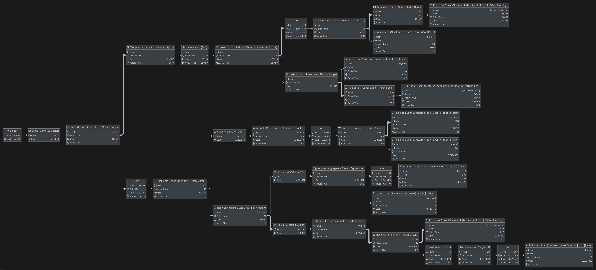

#### Aanbevolen indexen

Er zijn geen indexen voorgesteld door de database management tool voor deze query.

### Alternatieve Uitwerking 2

#### Query

```sql
WITH SeasonWinner
         AS (SELECT Race.RaceYear
                  , DriverStanding.DriverId
                  , CONCAT_WS(' ', Driver.Firstname, Driver.Lastname) AS DriverName
             FROM DriverStanding
                      INNER JOIN Race ON Race.RaceId = DriverStanding.RaceId
                      INNER JOIN Driver ON Driver.DriverId = DriverStanding.DriverId
             WHERE DriverStanding.Position = 1
               AND Race.RaceYear BETWEEN 2015 AND 2024
               AND Race.NrOfRound =
                   (SELECT MAX(Race2.NrOfRound) FROM Race Race2 WHERE Race2.RaceYear = Race.RaceYear)),
     ChampStandings
         AS (SELECT Race.RaceYear
                  , Race.RaceDate
                  , Race.NrOfRound
                  , Race.RaceName
                  , DriverStanding.Position                                                AS StandPos
                  , ROW_NUMBER() OVER (PARTITION BY Race.RaceYear ORDER BY Race.NrOfRound) AS Seq
                  , COUNT(*) OVER (PARTITION BY Race.RaceYear)                             AS TotalRaces
             FROM DriverStanding
                      INNER JOIN Race ON Race.RaceId = DriverStanding.RaceId
                      INNER JOIN SeasonWinner ON SeasonWinner.DriverId = DriverStanding.DriverId
                          AND SeasonWinner.RaceYear = Race.RaceYear),
     LastNonP1
         AS (SELECT RaceYear
                  , ISNULL(MAX(Seq), 0) AS LastNonP1Seq
             FROM ChampStandings
             WHERE StandPos > 1
             GROUP BY RaceYear),
     FirstUnbrokenP1
         AS (SELECT ChampStandings.RaceYear
                  , MIN(ChampStandings.Seq) AS FirstSeq
             FROM ChampStandings
                      INNER JOIN LastNonP1 ON LastNonP1.RaceYear = ChampStandings.RaceYear
             WHERE ChampStandings.Seq > LastNonP1.LastNonP1Seq
             GROUP BY ChampStandings.RaceYear),
     ChampWins
         AS (SELECT Race.RaceYear
                  , COUNT(*) AS RaceWins
             FROM Result
                      INNER JOIN Race ON Race.RaceId = Result.RaceId
                      INNER JOIN SeasonWinner
                                 ON SeasonWinner.DriverId = Result.DriverId
                                     AND SeasonWinner.RaceYear = Race.RaceYear
             WHERE Result.Position = 1
             GROUP BY Race.RaceYear)
SELECT SeasonWinner.RaceYear     AS Seizoen
     , SeasonWinner.DriverName   AS Kampioen
     , ChampWins.RaceWins        AS RaceWins
     , ChampStandings.TotalRaces AS TotaalRaces
     , ChampStandings.RaceDate   AS LeiderVanaf
     , ChampStandings.NrOfRound  AS Volgnummer
     , ChampStandings.RaceName   AS Race
FROM SeasonWinner
         JOIN ChampWins ON ChampWins.RaceYear = SeasonWinner.RaceYear
         JOIN FirstUnbrokenP1 ON FirstUnbrokenP1.RaceYear = SeasonWinner.RaceYear
         JOIN ChampStandings ON ChampStandings.RaceYear = SeasonWinner.RaceYear
             AND ChampStandings.Seq = FirstUnbrokenP1.FirstSeq
ORDER BY SeasonWinner.RaceYear;
```

#### Resultaten

| Seizoen | Kampioen       | RaceWins | TotaalRaces | LeiderVanaf | Volgnummer | Race                  |
|---------|----------------|----------|-------------|-------------|------------|-----------------------|
| 2015    | Lewis Hamilton | 10       | 19          | 2015-03-15  | 1          | Australian Grand Prix |
| 2016    | Nico Rosberg   | 9        | 21          | 2016-09-18  | 15         | Singapore Grand Prix  |
| 2017    | Lewis Hamilton | 9        | 20          | 2017-09-03  | 13         | Italian Grand Prix    |
| 2018    | Lewis Hamilton | 11       | 21          | 2018-07-22  | 11         | German Grand Prix     |
| 2019    | Lewis Hamilton | 11       | 21          | 2019-05-12  | 5          | Spanish Grand Prix    |
| 2020    | Lewis Hamilton | 11       | 17          | 2020-07-19  | 3          | Hungarian Grand Prix  |
| 2021    | Max Verstappen | 10       | 22          | 2021-10-10  | 16         | Turkish Grand Prix    |
| 2022    | Max Verstappen | 15       | 22          | 2022-05-22  | 6          | Spanish Grand Prix    |
| 2023    | Max Verstappen | 19       | 22          | 2023-03-05  | 1          | Bahrain Grand Prix    |
| 2024    | Max Verstappen | 9        | 24          | 2024-03-02  | 1          | Bahrain Grand Prix    |

#### Toelichting

Deze derde variant combineert elementen van beide eerdere implementaties. Net als de primaire uitwerking gebruikt deze query meerdere CTE's, maar het totaal aantal races wordt hier met een window function (`COUNT(*) OVER (PARTITION BY Race.RaceYear)`) in `ChampStandings` berekend, waardoor de aparte CTE `SeasonTotals` vervalt.

De bepaling van de eerste onafgebroken leidingspositie is anders opgezet: `LastNonP1` zoekt per seizoen de laatste race waarin de kampioen níet op positie 1 stond. `FirstUnbrokenP1` pakt vervolgens de eerstvolgende race daarna. Dit is een alternatieve benadering voor de logica in de eerdere implementaties, die ofwel via geneste subquery's ofwel via `NOT EXISTS` werkten.

#### Query plan

#### Aanbevolen indexen

### Vergelijking

Deze vergelijking richt zich voornamelijk op de onderhoudbaarheid en performance van de queryplannen. Zoals eerder zichtbaar in de queryplannen, is het plan van de primaire implementatie dermate groot dat het niet met de standaard diagramtool opgeslagen kon worden en daarom moest worden omgezet naar een Draw.io-diagram. Dit illustreert de hoge complexiteit van de query, die een groot aantal operators bevat om tot een resultaat te komen. Vanuit onderhoudsperspectief is dit onwenselijk: toekomstige aanpassingen of optimalisaties worden hierdoor complex en foutgevoelig.

Zowel de primaire als de alternatieve implementatie maken gebruik van spooling. De primaire implementatie doet dit echter aanzienlijk vaker. Daarnaast worden in de primaire implementatie dezelfde tabellen en indexen herhaaldelijk gelezen, wat leidt tot een toename in het aantal I/O-operaties. De alternatieve implementatie vertoont dit gedrag ook, maar in aanzienlijk mindere mate.

Verder valt op dat de primaire implementatie meer gebruikmaakt van Sort-operators. Sorteren is een relatief dure operatie en dient bij voorkeur beperkt te worden, bijvoorbeeld door gebruik te maken van geschikte indexen die de gewenste volgorde al leveren. Het frequente gebruik van sorteeroperaties maakt de primaire implementatie daardoor minder efficiënt dan de alternatieve variant.

Een ander belangrijk verschil is zichtbaar in de manier waarop met datasets wordt omgegaan. In de primaire implementatie wordt lange tijd gewerkt met relatief grote datasets, waarbij filtering pas in latere stadia van het queryplan plaatsvindt. Dit resulteert in grotere tussenresultaten en dus hogere kosten voor vervolgoperaties. De alternatieve implementatie daarentegen reduceert de dataset al in een vroeg stadium, met name door efficiëntere join-operaties. Hierdoor worden latere stappen uitgevoerd op een aanzienlijk kleinere dataset, wat de performance ten goede komt.

Tot slot scoort de alternatieve implementatie beter op het gebied van leesbaarheid en onderhoudbaarheid. De query is compacter en minder complex, wat zich direct vertaalt naar een overzichtelijker queryplan. Dit bevestigt dat een minder complexe query doorgaans leidt tot een efficiënter en beter te onderhouden uitvoeringsplan.

### Voorkeur

De voorkeur gaat daarom uit naar de alternatieve implementatie. Deze is niet alleen eenvoudiger te begrijpen en te onderhouden, maar ook efficiënter in uitvoering. De dataset wordt in een vroeg stadium gereduceerd en er wordt minder gebruikgemaakt van kostbare operaties zoals spooling en sorteren.

De alternatieve implementatie is echter nog niet volledig geoptimaliseerd. Zo bevat het queryplan nog steeds spool-operators waarbij bijvoorbeeld circa 2500 rijen worden opgeslagen, terwijl uiteindelijk slechts 23 rijen worden gebruikt. Dit wijst op verdere optimalisatiemogelijkheden, met name in het beperken van overbodige tussenresultaten.

## Welke coureurs hebben na deelname van een of meerdere seizoenen een periode niet deelgenomen en zijn in een later seizoen weer teruggekeerd in de Formule 1? Geef de naam van de coureur in alfabetische volgorde en daarnaast de periodes (in het format “1991–2006”, “2010–2012”) waarin ze deelgenomen hebben. Zet deze periodes op chronologische volgorde.

### Primaire Uitwerking

#### Query

```sql
SELECT CONCAT_WS(' ', Driver.Firstname, Driver.Lastname) AS Coureur
     , DriverYearRanges.Ranges                           AS Periodes
FROM Driver
         INNER JOIN DriverYearRanges ON DriverYearRanges.DriverId = Driver.DriverId
ORDER BY Coureur;
```

##### View

In diverse hierna volgende queries worden dezelfde perioden gebruikt, om te voorkomen dat deze complexe query steeds
opnieuw geschreven moet worden, is er gekozen om de volgende view te maken.

```sql
-- Create the view containing all the driver year ranges.
CREATE
OR ALTER
VIEW DriverYearRanges AS
WITH DriverYear
         AS (SELECT DISTINCT Result.DriverId AS DriverId
                           , Race.RaceYear   AS RaceYear
             FROM Result
                      INNER JOIN Race ON Race.RaceId = Result.RaceId
             ORDER BY DriverId, RaceYear
             OFFSET 0 ROWS),
     DriverYearGroup
         AS (SELECT DriverYear.DriverId AS DriverId
                  , DriverYear.RaceYear AS RaceYear
                  , (IIF(
                 LAG(DriverYear.RaceYear) OVER (PARTITION BY DriverYear.DriverId ORDER BY DriverYear.RaceYear) + 1 =
                 DriverYear.RaceYear, 0,
                 1))                    AS NewGroup
             FROM DriverYear),
     DriverYearIsland
         AS (SELECT DriverYearGroup.RaceYear                                                                        AS RaceYear
                  , DriverYearGroup.DriverId                                                                        AS DriverId
                  , SUM(DriverYearGroup.NewGroup)
                        OVER (ORDER BY DriverYearGroup.DriverId, DriverYearGroup.RaceYear ROWS UNBOUNDED PRECEDING) AS Grp
             FROM DriverYearGroup),
     DriverYearRange
         AS (SELECT DriverYearIsland.DriverId                                                           AS DriverId
                  , IIF(MIN(DriverYearIsland.RaceYear) = MAX(DriverYearIsland.RaceYear),
                        CAST(MIN(DriverYearIsland.RaceYear) AS VARCHAR),
                        CONCAT_WS('-', MIN(DriverYearIsland.RaceYear), MAX(DriverYearIsland.RaceYear))) AS Range
                  , MIN(DriverYearIsland.RaceYear)                                                      AS FromYear
                  , MAX(DriverYearIsland.RaceYear)                                                      AS ToYear
             FROM DriverYearIsland
             GROUP BY DriverYearIsland.DriverId, DriverYearIsland.Grp
             ORDER BY DriverId, ToYear
             OFFSET 0 ROWS)
SELECT DriverYearRange.DriverId                AS DriverId
     , STRING_AGG(DriverYearRange.Range, ', ') AS Ranges
FROM DriverYearRange
GROUP BY DriverYearRange.DriverId;
```

#### Resultaten

| Coureur         | Periodes                   |
|-----------------|----------------------------|
| Adolf Brudes    | 1952                       |
| Adolfo Cruz     | 1953                       |
| Adrián Campos   | 1987-1988                  |
| Adrian Sutil    | 2007-2011, 2013-2014       |
| Aguri Suzuki    | 1988-1995                  |
| Al Herman       | 1955-1957, 1959-1960       |
| Al Keller       | 1955-1959                  |
| Al Pease        | 1967, 1969                 |
| Alain de Changy | 1959                       |
| Alain Prost     | 1980-1991, 1993            |
| Alan Brown      | 1952-1954                  |
| Alan Jones      | 1975-1981, 1983, 1985-1986 |
| Alan Rees       | 1967                       |
| Alan Rollinson  | 1965                       |
| Alan Stacey     | 1958-1960                  |
| Albert Scherrer | 1953                       |
| ...             | ...                        |

#### Toelichting

Deze query gebruikt de view DriverYearRanges om per coureur te tonen in welke seizoenen hij heeft deelgenomen aan 
Formule 1-races. De hoofdquery zelf blijft daardoor eenvoudig: de coureurs worden gekoppeld aan de view en 
alfabetisch gesorteerd op naam.

De complexiteit zit vooral in de view. Eerst wordt per coureur bepaald in welke unieke jaren hij aan races heeft 
meegedaan. Daarna wordt met LAG() gekeken of een jaar direct aansluit op het vorige deelnamejaar van dezelfde coureur. 
Als dat niet zo is, betekent dit dat er een onderbreking is geweest en dat er een nieuwe periode moet beginnen.

Vervolgens worden deze opeenvolgende jaren gegroepeerd. Per groep wordt het eerste en laatste jaar bepaald. Als een 
groep maar uit één jaar bestaat, wordt alleen dat jaartal getoond. Als een groep meerdere opeenvolgende jaren bevat, 
wordt dit weergegeven als periode, bijvoorbeeld 2007-2011.

Tot slot worden alle periodes van dezelfde coureur samengevoegd met STRING_AGG. Hierdoor ontstaat per coureur één 
overzicht met alle deelnameperiodes in chronologische volgorde. De view is apart aangemaakt omdat dezelfde 
periode-indeling ook in latere queries opnieuw gebruikt kan worden.

#### Query plan


#### Aanbevolen indexen

```sql
create index Result_RaceId_index
    on dbo.Result (RaceId) include (DriverId)
go
```

### Alternatieve Uitwerking

#### Query

```sql
SELECT CONCAT_WS(' ', Driver.Firstname, Driver.Lastname) AS Coureur
     , DriverYearRanges.Ranges                           AS Periodes
FROM Driver
         INNER JOIN DriverYearRanges ON DriverYearRanges.DriverId = Driver.DriverId
WHERE DriverYearRanges.Ranges LIKE '%,%'
ORDER BY Coureur;
```

#### Resultaten

| Coureur         | Periodes                   |
|-----------------|----------------------------|
| Adrian Sutil    | 2007-2011, 2013-2014       |
| Al Herman       | 1955-1957, 1959-1960       |
| Al Pease        | 1967, 1969                 |
| Alain Prost     | 1980-1991, 1993            |
| Alan Jones      | 1975-1981, 1983, 1985-1986 |
| Fernando Alonso | 2001, 2003-2018, 2021-2024 |
| Michael Schumacher | 1991-2006, 2010-2012    |
| Niki Lauda      | 1971-1979, 1982-1985       |
| Nigel Mansell   | 1980-1992, 1994-1995       |
| ...             | ...                        |

#### Toelichting

Deze alternatieve query is vrijwel identiek aan de primaire uitwerking, maar voegt een extra filter toe: `WHERE DriverYearRanges.Ranges LIKE '%,%'`. Hiermee worden alleen coureurs getoond die minstens twee losse periodes in hun carrière hebben gehad — oftewel coureurs die een onderbreking hebben gehad en later zijn teruggekeerd.

De primaire uitwerking toont álle coureurs, inclusief degenen die één aaneengesloten periode hebben gereden. Met deze `WHERE`-clausule wordt het resultaat beperkt tot enkel de coureurs met een carrièreonderbreking, wat direct antwoord geeft op de oorspronkelijke vraag: "Welke coureurs hebben een periode niet deelgenomen en zijn later teruggekeerd?"

#### Query plan

#### Aanbevolen indexen

## Maak een overzicht van alle F1 coureurs die in hun volledige carrière 25 of meer wedstrijden hebben gewonnen. Toon per coureur zijn naam, in één veld een overzicht van de seizoenen waarin hij gereden heeft (ontbrekende jaren weglaten), het aantal races dat hij gestart is, het aantal races die hij gewonnen heeft en het percentage van het aantal races die hij gewonnen heeft ten opzichte van het aantal races dat hij gestart is. Een voorbeeld van hoe het er voor Michael Schumacher en Ayrton Senna uitziet, zie je hieronder.

### Primaire Uitwerking

#### Query

```sql
WITH DriverEntry
         AS (SELECT COUNT(1)        AS Entries
                  , Result.DriverId AS DriverId
             FROM Driver
                      INNER JOIN Result ON Result.DriverId = Driver.DriverId
             GROUP BY Result.DriverId),
     DriverWin
         AS (SELECT COUNT(1)        AS Wins
                  , Result.DriverId AS DriverId
             FROM Driver
                      INNER JOIN Result ON Result.DriverId = Driver.DriverId
             WHERE Result.Position = 1
             GROUP BY Result.DriverId)
SELECT CONCAT_WS(' ', Driver.Firstname, Driver.Lastname)                                  AS Driver
     , DriverYearRanges.Ranges                                                            AS Seasons
     , DriverEntry.Entries                                                                AS Entries
     , DriverWin.Wins                                                                     AS Wins
     , CONCAT(ROUND((CAST(DriverWin.Wins AS FLOAT) / DriverEntry.Entries) * 100, 2), '%') AS Percentage
FROM Driver
         INNER JOIN DriverEntry ON DriverEntry.DriverId = Driver.DriverId
         INNER JOIN DriverWin ON DriverWin.DriverId = Driver.DriverId
         LEFT JOIN DriverYearRanges ON DriverYearRanges.DriverId = Driver.DriverId
WHERE DriverWin.Wins >= 25
ORDER BY DriverWin.Wins DESC;
```

#### Resultaten

| Driver             | Seasons                    | Entries | Wins | Percentage |
|--------------------|----------------------------|---------|------|------------|
| Lewis Hamilton     | 2007-2024                  | 356     | 105  | 29.49%     |
| Michael Schumacher | 1991-2006, 2010-2012       | 308     | 91   | 29.55%     |
| Max Verstappen     | 2015-2024                  | 209     | 63   | 30.14%     |
| Sebastian Vettel   | 2007-2022                  | 300     | 53   | 17.67%     |
| Alain Prost        | 1980-1991, 1993            | 202     | 51   | 25.25%     |
| Ayrton Senna       | 1984-1994                  | 162     | 41   | 25.31%     |
| Fernando Alonso    | 2001, 2003-2018, 2021-2024 | 404     | 32   | 7.92%      |
| Nigel Mansell      | 1980-1992, 1994-1995       | 192     | 31   | 16.15%     |
| Jackie Stewart     | 1965-1973                  | 100     | 27   | 27%        |
| Niki Lauda         | 1971-1979, 1982-1985       | 174     | 25   | 14.37%     |
| Jim Clark          | 1960-1968                  | 73      | 25   | 34.25%     |

#### Toelichting

Deze query maakt een overzicht van coureurs die in hun volledige carrière minimaal 25 races hebben gewonnen. 
Eerst wordt in DriverEntry per coureur geteld aan hoeveel races hij heeft deelgenomen. Daarna wordt in DriverWin 
per coureur geteld hoeveel van deze races hij heeft gewonnen, waarbij alleen resultaten met `Position = 1` meetellen.

In de hoofdquery worden deze tellingen gekoppeld aan de tabel Driver, zodat de naam van de coureur getoond kan worden. 
Ook wordt de view DriverYearRanges gebruikt om de seizoenen waarin de coureur actief was als één overzicht te tonen. 
Hierdoor worden onderbroken carrières netjes weergegeven, bijvoorbeeld als meerdere periodes.

Vervolgens worden alleen coureurs geselecteerd met minimaal 25 overwinningen. Het winstpercentage wordt berekend 
door het aantal overwinningen te delen door het aantal deelnames en dit om te zetten naar een percentage. Tot 
slot wordt gesorteerd op het aantal overwinningen, zodat de meest succesvolle coureurs bovenaan staan.

#### Query plan


#### Aanbevolen indexen

```sql
create index Result_RaceId_index
    on dbo.Result (RaceId) include (DriverId)
go

create index Result_DriverId_index
    on dbo.Result (DriverId)
    go
```

### Alternatieve Uitwerking

#### Query

```sql
SELECT DISTINCT CONCAT_WS(' ', Driver.Firstname, Driver.Lastname)                          AS Driver
              , DriverYearRanges.Ranges                                                    AS Seasons
              , Result.Entries                                                             AS Entries
              , Result.Wins                                                                AS Wins
              , CONCAT(ROUND((CAST(Result.Wins AS FLOAT) / Result.Entries) * 100, 2), '%') AS Percentage
FROM Driver
     -- Calculate the number of entries and wins for each driver.
    CROSS APPLY (SELECT COUNT(*) OVER (PARTITION BY Result.DriverId) AS Entries
                           , COUNT(CASE WHEN Result.Position = 1 THEN 1 END)
                                   OVER (PARTITION BY Result.DriverId)    AS Wins
                      FROM Result
                      WHERE Result.DriverId = Driver.DriverId) AS Result
-- Join the merged ranges.
         INNER JOIN DriverYearRanges
ON DriverYearRanges.DriverId = Driver.DriverId
WHERE Result.Wins >= 25;
```

#### Resultaten

| Driver             | Seasons                    | Entries | Wins | Percentage |
|--------------------|----------------------------|---------|------|------------|
| Alain Prost        | 1980-1991, 1993            | 202     | 51   | 25.25%     |
| Ayrton Senna       | 1984-1994                  | 162     | 41   | 25.31%     |
| Fernando Alonso    | 2001, 2003-2018, 2021-2024 | 404     | 32   | 7.92%      |
| Jackie Stewart     | 1965-1973                  | 100     | 27   | 27%        |
| Jim Clark          | 1960-1968                  | 73      | 25   | 34.25%     |
| Lewis Hamilton     | 2007-2024                  | 356     | 105  | 29.49%     |
| Max Verstappen     | 2015-2024                  | 209     | 63   | 30.14%     |
| Michael Schumacher | 1991-2006, 2010-2012       | 308     | 91   | 29.55%     |
| Nigel Mansell      | 1980-1992, 1994-1995       | 192     | 31   | 16.15%     |
| Niki Lauda         | 1971-1979, 1982-1985       | 174     | 25   | 14.37%     |
| Sebastian Vettel   | 2007-2022                  | 300     | 53   | 17.67%     |

#### Toelichting

Deze alternatieve query berekent het aantal deelnames en overwinningen per coureur met behulp van `CROSS APPLY` en 
window functions. Voor elke coureur wordt in de gekoppelde subquery gekeken naar alle resultaten van die coureur. 
Met `COUNT(*) OVER (PARTITION BY Result.DriverId)` wordt het totaal aantal deelnames bepaald, en 
met `COUNT(CASE WHEN Result.Position = 1 THEN 1 END)` het aantal overwinningen.

Omdat de window functions dezelfde waarden teruggeven voor meerdere resultaatregels van dezelfde coureur, wordt 
`DISTINCT` gebruikt om uiteindelijk één regel per coureur over te houden. De deelnameperiodes worden opnieuw opgehaald 
uit de view DriverYearRanges.

Daarna filtert de query op coureurs met minimaal 25 overwinningen en berekent hij het winstpercentage op dezelfde 
manier als de primaire uitwerking. Deze aanpak levert inhoudelijk hetzelfde resultaat op, maar gebruikt een andere 
techniek: de tellingen worden niet vooraf in aparte CTE’s gegroepeerd, maar per coureur berekend binnen de `CROSS APPLY`.

#### Query plan


#### Aanbevolen indexen

Er zijn geen indexen voorgesteld door de database management tool voor deze query.

### Alternatieve Uitwerking 2

#### Query

```sql
SELECT CONCAT_WS(' ', Driver.Firstname, Driver.Lastname)                                   AS Driver
     , DriverYearRanges.Ranges                                                             AS Seasons
     , COUNT(*)                                                                            AS Entries
     , SUM(CASE WHEN Result.Position = 1 THEN 1 ELSE 0 END)                                AS Wins
     , CONCAT(ROUND(CAST(SUM(CASE WHEN Result.Position = 1 THEN 1 ELSE 0 END) AS FLOAT)
                    / COUNT(*) * 100, 2), '%')                                             AS Percentage
FROM Driver
         INNER JOIN Result ON Result.DriverId = Driver.DriverId
         LEFT JOIN DriverYearRanges ON DriverYearRanges.DriverId = Driver.DriverId
GROUP BY Driver.DriverId, Driver.Firstname, Driver.Lastname, DriverYearRanges.Ranges
HAVING SUM(CASE WHEN Result.Position = 1 THEN 1 ELSE 0 END) >= 25
ORDER BY Wins DESC;
```

#### Resultaten

| Driver             | Seasons                    | Entries | Wins | Percentage |
|--------------------|----------------------------|---------|------|------------|
| Lewis Hamilton     | 2007-2024                  | 356     | 105  | 29.49%     |
| Michael Schumacher | 1991-2006, 2010-2012       | 308     | 91   | 29.55%     |
| Max Verstappen     | 2015-2024                  | 209     | 63   | 30.14%     |
| Sebastian Vettel   | 2007-2022                  | 300     | 53   | 17.67%     |
| Alain Prost        | 1980-1991, 1993            | 202     | 51   | 25.25%     |
| Ayrton Senna       | 1984-1994                  | 162     | 41   | 25.31%     |
| Fernando Alonso    | 2001, 2003-2018, 2021-2024 | 404     | 32   | 7.92%      |
| Nigel Mansell      | 1980-1992, 1994-1995       | 192     | 31   | 16.15%     |
| Jackie Stewart     | 1965-1973                  | 100     | 27   | 27%        |
| Niki Lauda         | 1971-1979, 1982-1985       | 174     | 25   | 14.37%     |
| Jim Clark          | 1960-1968                  | 73      | 25   | 34.25%     |

#### Toelichting

Deze derde variant voert de aggregatie direct uit met een `GROUP BY` en conditionele aggregatie. In plaats van de tellingen in aparte CTE's of via window functions te berekenen, worden het aantal deelnames (`COUNT(*)`) en overwinningen (`SUM(CASE WHEN Result.Position = 1 THEN 1 ELSE 0 END)`) in één enkele aggregatiestap bepaald.

De filtering op minimaal 25 overwinningen gebeurt via de `HAVING`-clausule, omdat het om een geaggregeerde waarde gaat. De koppeling met `DriverYearRanges` gebeurt via een `LEFT JOIN`, zodat ook coureurs zonder geregistreerde periodes (theoretisch) niet wegvallen. Deze aanpak is de meest directe en compacte van de drie implementaties: alle aggregaties in één stap, zonder tussenliggende subquery's of CTE's.

#### Query plan

#### Aanbevolen indexen

### Vergelijking

Het eerste dat opvalt is dat een groot deel van de executieplannen overeenkomt, wat logisch is omdat beide implementaties gebruikmaken van dezelfde view. De vergelijking richt zich daarom voornamelijk op het afwijkende segment, dat in beide plannen bovenaan het diagram zichtbaar is.

Het grootste verschil is dat de alternatieve implementatie wederom veel gebruikmaakt van spooling in combinatie met nested loops. De primaire implementatie maakt ook gebruik van nested loops, maar zonder spooling. In beide gevallen zijn de nested loops een aandachtspunt. Bij de primaire implementatie ontbreekt spooling, wat op het eerste gezicht positief lijkt, maar worden er tienduizenden iteraties uitgevoerd, mogelijk met herhaalde lookups. De alternatieve implementatie sloopt tussenresultaten op in geheugen of op disk, wat ook nadelig kan zijn bij grotere aantallen rijen.

Opvallend is dat de primaire implementatie ervoor heeft gekozen geen spooling toe te passen, vermoedelijk omdat SQL Server meer rijen verwerkte dan verwacht. Bij de alternatieve implementatie komt de schatting beter overeen met het daadwerkelijke aantal gelezen rijen, wat de keuze voor spooling verklaart. De oorzaak ligt mogelijk bij onnauwkeurige statistieken, waardoor SQL Server geen goed onderbouwde beslissing kon nemen bij de primaire variant.

Tot slot is het queryplan van de primaire implementatie compacter en bevat het minder stappen. De gemaakte beslissingen zijn echter suboptimaal, wat leidt tot inefficiënt gebruik van de beschikbare data.

### Voorkeur

Onze voorkeur gaat uit naar de alternatieve implementatie, al is deze keuze niet zonder voorbehoud. Indien performance de prioriteit is, biedt de spooling in de alternatieve variant voordelen. Wanneer geheugen- en I/O-gebruik leidend zijn, zou de primaire implementatie de voorkeur verdienen, omdat deze geen potentiële disk- of geheugenspooling kent, al gaat dat ten koste van meer iteraties en bijbehorende I/O.

De primaire implementatie heeft een overzichtelijker queryplan; de alternatieve heeft beter leesbare code. Doorslaggevend is echter dat de alternatieve implementatie een betere overeenkomst toont tussen geschatte en daadwerkelijke rijen, waardoor SQL Server beter onderbouwde beslissingen kan nemen omtrent query-uitvoering. Om die reden heeft de alternatieve implementatie onze voorkeur.


## Er zijn niet ieder jaar evenveel wedstrijden gereden. Daarom is het interessant om te zien welke coureur procentueel de meeste races per seizoen heeft gewonnen. Maak onderstaand overzicht

### Primaire Uitwerking

#### Query

```sql
WITH DriverWins AS (SELECT Result.DriverId AS DriverId
                         , Race.RaceYear   AS RaceYear
                         , COUNT(1)        AS Wins
                    FROM Result
                             INNER JOIN Race ON Race.RaceId = Result.RaceId
                    WHERE Result.Position = 1
                    GROUP BY Result.DriverId, Race.RaceYear),
     DriverRaces AS (SELECT Result.DriverId AS DriverId
                          , Race.RaceYear   AS RaceYear
                          , COUNT(1)        AS Races
                     FROM Result
                              INNER JOIN Race ON Race.RaceId = Result.RaceId
                     GROUP BY Result.DriverId, Race.RaceYear)
SELECT CONCAT_WS(' ', Driver.Firstname, Driver.Lastname) AS Driver
     , DriverRaces.RaceYear                              AS Season
     , DriverRaces.Races                                 AS Races
     , COALESCE(DriverWins.Wins, 0)                      AS Wins
     , CONCAT(CAST(ROUND(100.0 * COALESCE(DriverWins.Wins, 0) / NULLIF(DriverRaces.Races, 0), 2) AS DECIMAL(10, 2)),
              '%')                                       AS Percentage
FROM DriverRaces
         INNER JOIN Driver ON Driver.DriverId = DriverRaces.DriverId
         LEFT JOIN DriverWins
                   ON DriverWins.DriverId = DriverRaces.DriverId
                       AND DriverWins.RaceYear = DriverRaces.RaceYear
ORDER BY COALESCE(DriverWins.Wins, 0) * 1.0 / DriverRaces.Races DESC;
```

#### Resultaten

| Driver             | Season | Races | Wins | Percentage |
|--------------------|--------|-------|------|------------|
| Jim Rathmann       | 1960   | 1     | 1    | 100.00%    |
| Sam Hanks          | 1957   | 1     | 1    | 100.00%    |
| Jim Clark          | 1968   | 1     | 1    | 100.00%    |
| Johnnie Parsons    | 1950   | 1     | 1    | 100.00%    |
| Bob Sweikert       | 1955   | 1     | 1    | 100.00%    |
| Troy Ruttman       | 1952   | 1     | 1    | 100.00%    |
| Bill Vukovich      | 1953   | 1     | 1    | 100.00%    |
| Pat Flaherty       | 1956   | 1     | 1    | 100.00%    |
| Lee Wallard        | 1951   | 1     | 1    | 100.00%    |
| Bill Vukovich      | 1954   | 1     | 1    | 100.00%    |
| Jimmy Bryan        | 1958   | 1     | 1    | 100.00%    |
| Max Verstappen     | 2023   | 22    | 19   | 86.36%     |
| Alberto Ascari     | 1952   | 7     | 6    | 85.71%     |
| Juan Fangio        | 1954   | 8     | 6    | 75.00%     |
| Michael Schumacher | 2004   | 18    | 13   | 72.22%     |
| Jim Clark          | 1963   | 10    | 7    | 70.00%     |
| ...                | ...    | ...   | ...  | ...        |

#### Toelichting

Deze query berekent per coureur en per seizoen welk percentage van zijn gereden races hij heeft gewonnen. Eerst 
wordt in DriverWins per coureur en seizoen geteld hoeveel races hij heeft gewonnen. Daarna wordt in DriverRaces 
per coureur en seizoen geteld aan hoeveel races hij totaal heeft deelgenomen.

In de hoofdquery worden deze twee tellingen gecombineerd. Hierbij wordt een `LEFT JOIN` gebruikt, zodat ook seizoenen 
waarin een coureur geen enkele race won toch in het resultaat blijven staan. Met `COALESCE` worden ontbrekende 
overwinningen dan als 0 weergegeven.

Het winstpercentage wordt berekend door het aantal overwinningen te delen door het aantal gereden races in dat seizoen. 
`NULLIF` voorkomt hierbij dat er door nul gedeeld wordt. Tot slot wordt gesorteerd op het hoogste winstpercentage, 
waardoor coureurs met het grootste aandeel gewonnen races bovenaan komen te staan.

#### Query plan

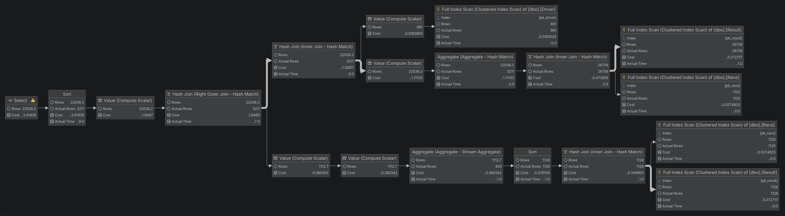

#### Aanbevolen indexen

```sql
create index Result_RaceId_index
    on dbo.Result (RaceId) include (DriverId)
go
```

### Alternatieve Uitwerking

#### Query

```sql
SELECT CONCAT_WS(' ', Driver.Firstname, Driver.Lastname) AS Driver
     , Race.RaceYear                                     AS Season
     , COUNT(1)                                          AS Races
     , SUM(IIF(Result.Position = 1, 1, 0))               AS Wins
     , CONCAT(CAST(ROUND(100.0 * SUM(IIF(Result.Position = 1, 1, 0)) / NULLIF(COUNT(*), 0), 2) AS DECIMAL(10, 2)),
              '%')                                       AS Percentage
FROM Result
         INNER JOIN Race ON Race.RaceId = Result.RaceId
         INNER JOIN Driver ON Driver.DriverId = Result.DriverId
GROUP BY Driver.DriverId, Driver.Firstname, Driver.Lastname, Race.RaceYear
ORDER BY SUM(IIF(Result.Position = 1, 1, 0)) * 1.0 / COUNT(1) DESC;
```

#### Resultaten

| Driver             | Season | Races | Wins | Percentage |
|--------------------|--------|-------|------|------------|
| Johnnie Parsons    | 1950   | 1     | 1    | 100.00%    |
| Lee Wallard        | 1951   | 1     | 1    | 100.00%    |
| Troy Ruttman       | 1952   | 1     | 1    | 100.00%    |
| Bill Vukovich      | 1953   | 1     | 1    | 100.00%    |
| Bill Vukovich      | 1954   | 1     | 1    | 100.00%    |
| Bob Sweikert       | 1955   | 1     | 1    | 100.00%    |
| Pat Flaherty       | 1956   | 1     | 1    | 100.00%    |
| Sam Hanks          | 1957   | 1     | 1    | 100.00%    |
| Jimmy Bryan        | 1958   | 1     | 1    | 100.00%    |
| Jim Rathmann       | 1960   | 1     | 1    | 100.00%    |
| Jim Clark          | 1968   | 1     | 1    | 100.00%    |
| Max Verstappen     | 2023   | 22    | 19   | 86.36%     |
| Alberto Ascari     | 1952   | 7     | 6    | 85.71%     |
| Juan Fangio        | 1954   | 8     | 6    | 75.00%     |
| Michael Schumacher | 2004   | 18    | 13   | 72.22%     |
| Jim Clark          | 1963   | 10    | 7    | 70.00%     |
| ...                | ...    | ...   | ...  | ...        |

#### Toelichting

Deze alternatieve query voert dezelfde berekening compacter uit. In plaats van aparte CTE’s voor het aantal races 
en het aantal overwinningen, worden beide waarden direct binnen één GROUP BY berekend.

Per coureur en seizoen telt `COUNT(1)` het totaal aantal gereden races. Het aantal overwinningen wordt berekend met 
`SUM(IIF(Result.Position = 1, 1, 0))`: voor elke gewonnen race telt de query 1 op, en voor elke niet-gewonnen race 0.

Daarna wordt het winstpercentage direct berekend met dezelfde waarden. Ook hier zorgt `NULLIF` ervoor dat delen door nul 
wordt voorkomen. Deze aanpak is korter en overzichtelijker, omdat alle aggregaties in één stap worden uitgevoerd.

#### Query plan

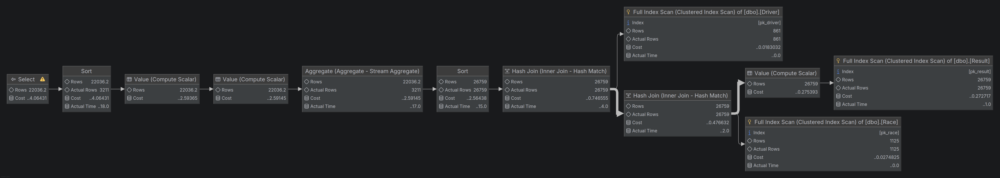

#### Aanbevolen indexen

```sql
create index Result_RaceId_index
    on dbo.Result (RaceId) include (DriverId, Position)
go
```

### Alternatieve Uitwerking 2

#### Query

```sql
SELECT CONCAT_WS(' ', d.Firstname, d.Lastname)                          AS Driver
     , dr.RaceYear                                                      AS Season
     , ss.Races                                                         AS Races
     , ss.Wins                                                          AS Wins
     , CONCAT(CAST(ROUND(100.0 * ss.Wins / NULLIF(ss.Races, 0), 2)
                  AS DECIMAL(10, 2)), '%')                              AS Percentage
FROM (SELECT DISTINCT Result.DriverId, Race.RaceYear
      FROM Result
               INNER JOIN Race ON Race.RaceId = Result.RaceId) dr
         CROSS APPLY (SELECT COUNT(*)                                                AS Races
                           , SUM(CASE WHEN res.Position = 1 THEN 1 ELSE 0 END)       AS Wins
                      FROM Result res
                               INNER JOIN Race r ON r.RaceId = res.RaceId
                      WHERE res.DriverId = dr.DriverId
                        AND r.RaceYear = dr.RaceYear) ss
         INNER JOIN Driver d ON d.DriverId = dr.DriverId
ORDER BY ss.Wins * 1.0 / ss.Races DESC;
```

#### Resultaten

| Driver             | Season | Races | Wins | Percentage |
|--------------------|--------|-------|------|------------|
| Jim Rathmann       | 1960   | 1     | 1    | 100.00%    |
| Sam Hanks          | 1957   | 1     | 1    | 100.00%    |
| Jim Clark          | 1968   | 1     | 1    | 100.00%    |
| Johnnie Parsons    | 1950   | 1     | 1    | 100.00%    |
| Bob Sweikert       | 1955   | 1     | 1    | 100.00%    |
| Troy Ruttman       | 1952   | 1     | 1    | 100.00%    |
| Bill Vukovich      | 1953   | 1     | 1    | 100.00%    |
| Pat Flaherty       | 1956   | 1     | 1    | 100.00%    |
| Lee Wallard        | 1951   | 1     | 1    | 100.00%    |
| Bill Vukovich      | 1954   | 1     | 1    | 100.00%    |
| Jimmy Bryan        | 1958   | 1     | 1    | 100.00%    |
| Max Verstappen     | 2023   | 22    | 19   | 86.36%     |
| ...                | ...    | ...   | ...  | ...        |

#### Toelichting

Deze derde variant gebruikt een afgeleide tabel (`dr`) om eerst alle unieke combinaties van coureur en seizoen op te halen via `SELECT DISTINCT`. Per combinatie wordt vervolgens met `CROSS APPLY` een subquery (`ss`) uitgevoerd die het aantal races en overwinningen in dat specifieke seizoen voor die coureur berekent.

In tegenstelling tot de eerdere implementaties werkt deze query niet met een `GROUP BY` over de hele dataset, maar per individuele coureur-seizoen-combinatie. Dit kan voordelig zijn wanneer er een index op `Result(DriverId, RaceId)` aanwezig is, omdat de `CROSS APPLY`-subquery dan efficiënt per coureur de benodigde aggregaties kan uitvoeren. Het winstpercentage wordt vervolgens per rij berekend en de sortering gebeurt op aflopend percentage.

#### Query plan

#### Aanbevolen indexen

### Vergelijking

Het meest opvallende verschil tussen de twee queryplannen is de manier waarop de aggregatie wordt uitgevoerd. De primaire implementatie verdeelt het werk over twee afzonderlijke aggregatiepaden, elk met een eigen Hash Match Aggregate, die vervolgens worden samengevoegd via een Right Outer Join. Dit betekent dat zowel de Result- als de Race-tabel twee keer worden gescand: 1 keer voor DriverWins en 1 keer voor DriverRaces. De alternatieve implementatie voert alle aggregaties in één stap uit via een Stream Aggregate, waarbij elke tabel slechts 1 keer wordt gescand.

Een ander verschil is het type join dat wordt gebruikt om de twee deelresultaten samen te voegen. De primaire implementatie vereist een Right Outer Join om de gevallen af te handelen waarin een coureur geen overwinningen heeft in een bepaald seizoen. De alternatieve implementatie heeft deze extra join niet nodig, omdat wins en races direct in dezelfde aggregatiestap worden berekend en een ontbrekende overwinning simpelweg als nul uitkomt via `SUM(IIF(...))`.

Het queryplan van de alternatieve implementatie is daarmee lineairder en bevat minder operators. De primaire implementatie heeft een complexer plan met meer vertakkingen, al is de code door de benoemde CTEs wel explicieter leesbaar.

### Voorkeur

Onze voorkeur gaat uit naar de alternatieve implementatie. Het queryplan is eenvoudiger van opzet: minder operators, geen dubbele index scans en geen extra join om twee onafhankelijke deelresultaten samen te voegen. Doorslaggevend is daarnaast dat de alternatieve implementatie inherent minder foutgevoelig is: omdat wins en races uit exact dezelfde rijen worden berekend, kan er geen mismatch ontstaan die bij de CTE-aanpak theoretisch mogelijk is bij een onjuiste join-conditie. De compactere code sluit hier goed op aan en maakt de implementatie eenvoudiger te onderhouden.

## Maak de eindstand voor de coureurs van 2021 na. Zie onderstaand overzicht voor de juiste punten.

### Invoegen extra gegevens

#### Query

```sql
-- Create helper function for splitting strings.
CREATE
OR
ALTER FUNCTION dbo.SplitPart(@s NVARCHAR(MAX), @sep NCHAR (1), @n INT)
    RETURNS NVARCHAR(MAX) AS
BEGIN
RETURN (SELECT value
        FROM (SELECT value, ROW_NUMBER() OVER (ORDER BY (SELECT NULL)) AS rn
              FROM STRING_SPLIT(@s, @sep)) t
        WHERE rn = @n)
END;
GO

-- Drop the existing race results table if it exists.
DROP TABLE IF EXISTS #RaceResults;
GO

-- Create the race results.
CREATE TABLE #RaceResults
(
    RaceNr      INT,
    Circuit     NVARCHAR(100),
    POS         INT,
    NO          INT,
    Driver      NVARCHAR(100),
    Car         NVARCHAR(100),
    Laps        INT,
    TimeRetired NVARCHAR(50),
    Points      INT
);
GO

-- Create the CSV string.
DECLARE
@csv NVARCHAR = N'202114;Monza;1;77;Valtteri Bottas;MERCEDES;18;27:54.078;3
202114;Monza;2;33;Max Verstappen;RED BULL RACING HONDA;18;+2.325s;2
202114;Monza;3;3;Daniel Ricciardo;MCLAREN MERCEDES;18;+14.534s;1
202110;Silverstone;1;33;Max Verstappen;RED BULL RACING HONDA;17;25:38.426;3
202110;Silverstone;2;44;Lewis Hamilton;MERCEDES;17;+1.430s;2
202110;Silverstone;3;77;Valtteri Bottas;MERCEDES;17;+7.502s;1
202119;Sao Paulo;1;77;Valtteri Bottas;MERCEDES;24;29:09.559;3
202119;Sao Paulo;2;33;Max Verstappen;RED BULL RACING HONDA;24;+1.170s;2
202119;Sao Paulo;3;55;Carlos Sainz;FERRARI;24;+18.723s;1'';

-- Parse the CSV string into the temporary table.
INSERT INTO #RaceResults
SELECT TRY_CAST(dbo.SplitPart(value, ';', 1) AS INT), -- RaceNr
       dbo.SplitPart(value, ';', 2),                  -- Circuit
       TRY_CAST(dbo.SplitPart(value, ';', 3) AS INT), -- POS
       TRY_CAST(dbo.SplitPart(value, ';', 4) AS INT), -- NO
       dbo.SplitPart(value, ';', 5),                  -- Driver
       dbo.SplitPart(value, ';', 6),                  -- Car
       TRY_CAST(dbo.SplitPart(value, ';', 7) AS INT), -- Laps
       dbo.SplitPart(value, ';', 8),                  -- Time/Retired
       TRY_CAST(dbo.SplitPart(value, ';', 9) AS INT)  -- Points
FROM STRING_SPLIT(@csv, CHAR(10))
WHERE TRIM(value) <> '';

-- Create circuits
INSERT INTO Circuit (CircuitId, CircuitRef, CircuitName, CircuitLocation, Country)
SELECT ROW_NUMBER() OVER (ORDER BY RaceResults.Circuit)
           + ISNULL((SELECT MAX(CircuitId) FROM Circuit), 0), RaceResults.Circuit,
       RaceResults.Circuit,
       RaceResults.Circuit,
       'Unknown'
FROM (SELECT DISTINCT Circuit
      FROM #RaceResults) AS RaceResults
WHERE NOT EXISTS (SELECT 1
                  FROM Circuit c
                  WHERE c.CircuitName = RaceResults.Circuit);

-- Create constructors
INSERT INTO Constructor (ConstructorId, ConstructorRef, ContstructorName, Nationality, ConstructorUrl)
SELECT ROW_NUMBER() OVER (ORDER BY RaceResults.Car)
           + ISNULL((SELECT MAX(ConstructorId) FROM Constructor), 0), ISNULL(RaceResults.Car, 'UNKNOWN'),
       ISNULL(RaceResults.Car, 'UNKNOWN'),
       'Unknown',
       ''
FROM (SELECT DISTINCT Car
      FROM #RaceResults) AS RaceResults
WHERE NOT EXISTS (SELECT 1
                  FROM Constructor c
                  WHERE c.ContstructorName = RaceResults.Car);

-- Create drivers
INSERT INTO Driver (DriverId, DriverRef, DriverNumber, Firstname, Lastname, Nationality)
SELECT DISTINCT #RaceResults.NO,
                #RaceResults.Driver,
                #RaceResults.NO, LEFT (
                #RaceResults.Driver, CHARINDEX(' ',
                #RaceResults.Driver + ' ') - 1), LTRIM(SUBSTRING (
                #RaceResults.Driver, CHARINDEX(' ',
                #RaceResults.Driver + ' '), LEN(
                #RaceResults.Driver))), 'Unknown'
FROM #RaceResults
WHERE #RaceResults.NO IS NOT NULL
  AND NOT EXISTS (SELECT 1
    FROM Driver d
    WHERE d.DriverId = #RaceResults.NO);

-- Create seasons
INSERT INTO Season (RaceYear, SeasonUrl)
SELECT DISTINCT #RaceResults.RaceNr / 100 AS RaceYear,
                ''
FROM #RaceResults
WHERE NOT EXISTS (SELECT 1
                  FROM Season s
                  WHERE s.RaceYear = #RaceResults.RaceNr / 100);

-- Create races
INSERT INTO Race (RaceId, RaceYear, NrOfRound, CircuitId, RaceName, RaceDate)
SELECT DISTINCT #RaceResults.RaceNr,
                #RaceResults.RaceNr / 100,
                #RaceResults.RaceNr % 100,
                c.CircuitId, #RaceResults.Circuit, GETDATE()
FROM #RaceResults
    JOIN Circuit c
ON c.CircuitName = #RaceResults.Circuit
WHERE NOT EXISTS (SELECT 1
    FROM Race r
    WHERE r.RaceId = #RaceResults.RaceNr);

-- Create results
INSERT INTO Result
(ResultId,
 RaceId,
 DriverId,
 ConstructorId,
 Grid,
 Position,
 PositionText,
 PositionOrder,
 Points,
 Laps,
 Time,
 ResultStatusId)
SELECT ROW_NUMBER() OVER (ORDER BY #RaceResults.RaceNr, #RaceResults.POS)
           + ISNULL((SELECT MAX(ResultId) FROM Result), 0), #RaceResults.RaceNr,
       d.DriverId,
       c.ConstructorId,
       #RaceResults.POS,
       #RaceResults.POS,
       CAST(#RaceResults.POS AS NVARCHAR),
       #RaceResults.POS,
       #RaceResults.Points,
       #RaceResults.Laps,
       #RaceResults.TimeRetired,
       1
FROM #RaceResults
         JOIN Driver d ON d.DriverId = #RaceResults.NO
         JOIN Constructor c ON c.ContstructorName = #RaceResults.Car
WHERE NOT EXISTS (SELECT 1
                  FROM Result r
                  WHERE r.RaceId = #RaceResults.RaceNr
                    AND r.DriverId = d.DriverId);
```

#### Toelichting

Om de gegevens in te laden heb ik deze handmatig moeten uitlezen van het CSV formaat. Helaas omdat ik Docker gebruik,
was het eenvoudig inladen van CSV bestanden met de ingebouwde functies niet mogelijk; vandaar dat ik het zelf heb
moeten doen. Het inladen van deze gegevens is gegaan in een tijdelijke tabel.

Deze tijdelijke tabel wordt stapgewijs overgezet naar de daadwerkelijke tables. Dit is in verschillende stappen gegaan,
waarbij er in iedere stap op basis van de gegevens uit de tijdelijke tabel (en enige aannames) de nieuwe rijen aan
worden gemaakt. Hierbij is er ook zo veel mogelijk gedaan om te checken dat er geen duplicate rijen worden toegevoegd
(dit door middel van NOT EXISTS met een subquery).

### Primaire Uitwerking

#### Query

```sql
SELECT DriverStanding.Position                  AS POS
     , Driver.Firstname + ' ' + Driver.Lastname AS DRIVER
     , Driver.Nationality                       AS NATIONALITY
     , Constructor.ContstructorName             AS CAR
     , DriverStanding.Points                    AS PTS
FROM DriverStanding
         INNER JOIN Driver ON DriverStanding.DriverId = Driver.DriverId
         INNER JOIN Race ON DriverStanding.RaceId = Race.RaceId
         INNER JOIN Result ON Result.RaceId = Race.RaceId
    AND Result.DriverId = Driver.DriverId
         INNER JOIN Constructor ON Result.ConstructorId = Constructor.ConstructorId
WHERE Race.RaceYear = 2021
  AND Race.RaceId = (SELECT MAX(RaceId)
                     FROM Race
                     WHERE RaceYear = 2021)
ORDER BY DriverStanding.Position;
```

#### Resultaten

| POS | DRIVER           | NATIONALITY | CAR            | PTS            |
|-----|------------------|-------------|----------------|----------------|
| 1   | Max Verstappen   | Dutch       | Red Bull       | 395.5000000000 |
| 2   | Lewis Hamilton   | British     | Mercedes       | 387.5000000000 |
| 3   | Valtteri Bottas  | Finnish     | Mercedes       | 226.0000000000 |
| 4   | Sergio Pérez     | Mexican     | Red Bull       | 190.0000000000 |
| 5   | Carlos Sainz     | Spanish     | Ferrari        | 164.5000000000 |
| 6   | Lando Norris     | British     | McLaren        | 160.0000000000 |
| 7   | Charles Leclerc  | Monegasque  | Ferrari        | 159.0000000000 |
| 8   | Daniel Ricciardo | Australian  | McLaren        | 115.0000000000 |
| 9   | Pierre Gasly     | French      | AlphaTauri     | 110.0000000000 |
| 10  | Fernando Alonso  | Spanish     | Alpine F1 Team | 81.0000000000  |
| 11  | Esteban Ocon     | French      | Alpine F1 Team | 74.0000000000  |
| ... | ...              | ...         | ...            | ...            |

#### Toelichting

Deze query maakt de eindstand van het coureurskampioenschap van 2021 na. Hiervoor wordt gebruikgemaakt van de tabel 
DriverStanding, waarin de stand per race is opgeslagen. Door te filteren op het seizoen 2021 en de laatste race van 
dat seizoen, wordt de definitieve eindstand geselecteerd.

De query koppelt deze eindstand aan de tabellen Driver, Race, Result en Constructor. Daardoor kunnen naast de positie 
en punten ook de naam, nationaliteit en auto/constructor van de coureur worden getoond. De koppeling met Result wordt 
gebruikt om de constructor te bepalen waarmee de coureur in die race heeft gereden.

Tot slot wordt gesorteerd op DriverStanding.Position, zodat de eindstand in de juiste volgorde wordt weergegeven: van 
kampioen naar lager geklasseerde coureurs.

#### Query plan

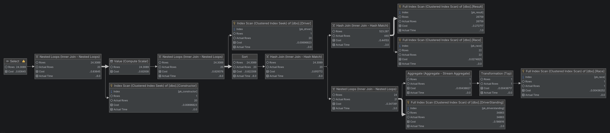

#### Aanbevolen indexen

```sql
create index Result_RaceId_index
    on dbo.Result (RaceId) include (DriverId, ConstructorId)
go

create index DriverStanding_RaceId_index
    on dbo.DriverStanding (RaceId) include (DriverId, Points, Position)
go
```

### Alternatieve Uitwerking

#### Query

```sql
SELECT DriverStanding.Position                  AS POS
     , Driver.Firstname + ' ' + Driver.Lastname AS DRIVER
     , Driver.Nationality                       AS NATIONALITY
     , Constructor.ContstructorName             AS CAR
     , DriverStanding.Points                    AS PTS
FROM DriverStanding
         JOIN Driver ON DriverStanding.DriverId = Driver.DriverId
         JOIN Race ON DriverStanding.RaceId = Race.RaceId
    CROSS APPLY (SELECT TOP 1 Result.ConstructorId
                      FROM Result
                      WHERE Result.DriverId = Driver.DriverId
                        AND Result.RaceId = Race.RaceId
                      ORDER BY Result.ResultId DESC) AS LatestResult
         JOIN Constructor
ON LatestResult.ConstructorId = Constructor.ConstructorId
WHERE Race.RaceYear = 2021
  AND Race.RaceId = (SELECT TOP 1 RaceId
    FROM Race
    WHERE RaceYear = 2021
    ORDER BY RaceDate DESC)
ORDER BY DriverStanding.Position;
```

#### Resultaten

| POS | DRIVER           | NATIONALITY | CAR            | PTS            |
|-----|------------------|-------------|----------------|----------------|
| 1   | Max Verstappen   | Dutch       | Red Bull       | 395.5000000000 |
| 2   | Lewis Hamilton   | British     | Mercedes       | 387.5000000000 |
| 3   | Valtteri Bottas  | Finnish     | Mercedes       | 226.0000000000 |
| 4   | Sergio Pérez     | Mexican     | Red Bull       | 190.0000000000 |
| 5   | Carlos Sainz     | Spanish     | Ferrari        | 164.5000000000 |
| 6   | Lando Norris     | British     | McLaren        | 160.0000000000 |
| 7   | Charles Leclerc  | Monegasque  | Ferrari        | 159.0000000000 |
| 8   | Daniel Ricciardo | Australian  | McLaren        | 115.0000000000 |
| 9   | Pierre Gasly     | French      | AlphaTauri     | 110.0000000000 |
| 10  | Fernando Alonso  | Spanish     | Alpine F1 Team | 81.0000000000  |
| 11  | Esteban Ocon     | French      | Alpine F1 Team | 74.0000000000  |
| ... | ...              | ...         | ...            | ...            |

#### Toelichting

Deze alternatieve query haalt dezelfde eindstand op, maar bepaalt de constructor via een `CROSS APPLY`. Per coureur 
wordt binnen de laatste race van 2021 het bijbehorende resultaat opgezocht en daaruit de ConstructorId gehaald. Met 
`TOP 1` wordt één resultaatregel geselecteerd.

Daarnaast wordt de laatste race van 2021 bepaald met `SELECT TOP 1 RaceId ... ORDER BY RaceDate DESC`. Daardoor wordt 
expliciet gekeken naar de meest recente racedatum binnen het seizoen, in plaats van naar het hoogste RaceId.

Daarna worden de gegevens gekoppeld aan DriverStanding, Driver, Race en Constructor. Het eindresultaat is hetzelfde 
overzicht van de eindstand, inclusief positie, coureur, nationaliteit, constructor en punten.

#### Query plan

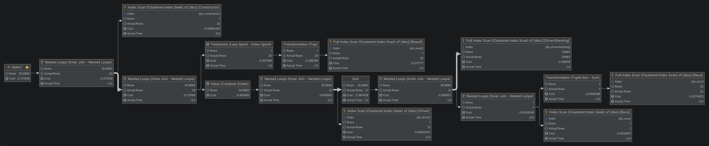

#### Aanbevolen indexen

```sql
create index Result_RaceId_DriverId_index
    on dbo.Result (RaceId, DriverId)
go

create index DriverStanding_RaceId_index
    on dbo.DriverStanding (RaceId) include (DriverId, Points, Position)
go
```

### Alternatieve Uitwerking 2

#### Query

```sql
WITH LastRace AS (
    SELECT TOP 1 RaceId
    FROM Race
    WHERE RaceYear = 2021
    ORDER BY RaceDate DESC
)
SELECT DriverStanding.Position                                       AS POS
     , Driver.Firstname + ' ' + Driver.Lastname                      AS DRIVER
     , Driver.Nationality                                            AS NATIONALITY
     , (SELECT TOP 1 Constructor.ContstructorName
        FROM Result
                 INNER JOIN Constructor ON Constructor.ConstructorId = Result.ConstructorId
        WHERE Result.DriverId = Driver.DriverId
          AND Result.RaceId = LastRace.RaceId
        ORDER BY Result.ResultId DESC)                               AS CAR
     , DriverStanding.Points                                         AS PTS
FROM DriverStanding
         INNER JOIN Driver ON DriverStanding.DriverId = Driver.DriverId
         INNER JOIN Race ON DriverStanding.RaceId = Race.RaceId
         CROSS JOIN LastRace
WHERE Race.RaceYear = 2021
  AND Race.RaceId = LastRace.RaceId
ORDER BY DriverStanding.Position;
```

#### Resultaten

| POS | DRIVER           | NATIONALITY | CAR            | PTS            |
|-----|------------------|-------------|----------------|----------------|
| 1   | Max Verstappen   | Dutch       | Red Bull       | 395.5000000000 |
| 2   | Lewis Hamilton   | British     | Mercedes       | 387.5000000000 |
| 3   | Valtteri Bottas  | Finnish     | Mercedes       | 226.0000000000 |
| 4   | Sergio Perez     | Mexican     | Red Bull       | 190.0000000000 |
| 5   | Carlos Sainz     | Spanish     | Ferrari        | 164.5000000000 |
| 6   | Lando Norris     | British     | McLaren        | 160.0000000000 |
| 7   | Charles Leclerc  | Monegasque  | Ferrari        | 159.0000000000 |
| 8   | Daniel Ricciardo | Australian  | McLaren        | 115.0000000000 |
| 9   | Pierre Gasly     | French      | AlphaTauri     | 110.0000000000 |
| 10  | Fernando Alonso  | Spanish     | Alpine F1 Team | 81.0000000000  |
| 11  | Esteban Ocon     | French      | Alpine F1 Team | 74.0000000000  |
| ... | ...              | ...         | ...            | ...            |

#### Toelichting

Deze derde variant isoleert de bepaling van de laatste race in een aparte CTE `LastRace`, die via `CROSS JOIN` aan elke rij wordt toegevoegd. De constructor wordt hier opgehaald via een gecorreleerde subquery in de `SELECT`-clausule, die per coureur het meest recente resultaat in de laatste race opzoekt.

Het gebruik van een `CROSS JOIN` met een CTE van één rij is een lichte en overzichtelijke manier om de laatste race beschikbaar te maken voor de rest van de query. De gecorreleerde subquery voor de constructor maakt de query zelf compacter, maar kan bij grotere aantallen rijen minder efficiënt zijn dan een `JOIN`-aanpak, omdat de subquery per teruggegeven rij opnieuw wordt uitgevoerd.

#### Query plan

#### Aanbevolen indexen

### Vergelijking

Het meest opvallende verschil tussen de twee queryplannen is de manier waarop de constructor wordt opgezocht. De primaire implementatie koppelt de `Result`-tabel via een *Hash Join*, waarvoor eerst een *Full Index Scan* over ongeveer 26 duizend rijen wordt uitgevoerd. De alternatieve implementatie doet dit via een `CROSS APPLY` met een *Lazy Spool* en een Transformation (Top), wat overeenkomt met de TOP 1 in de subquery. Hierdoor wordt per coureur slechts 1 rij uit Result opgehaald in plaats van de volledige tabel te scannen.

Ook de bepaling van de laatste race verloopt anders. De primaire implementatie gebruikt een Stream Aggregate met een *Transformation (Top)* om het hoogste RaceId te vinden. De alternatieve implementatie gebruikt een *TopN* Sort op de `Race`-tabel, passend bij de `ORDER BY RaceDate DESC` aanpak. Beide leiden tot 1 rij, maar via een ander pad.

Tot slot bevat de primaire implementatie een expliciete *Sort*-operator voor de *Hash Join* op `Result`. In de alternatieve implementatie ontbreekt deze, maar verschijnt een *Lazy Spool* die tussenresultaten buffert voor hergebruik in de nested loops.

### Voorkeur

De voorkeur gaat uit naar de alternatieve implementatie. Het belangrijkste bezwaar tegen de primaire variant is de 
*Full Index Scan* over de volledige Result-tabel, die de alternatieve implementatie met de `TOP 1 CROSS APPLY` weet te 
vermijden. Daarnaast is het gebruik van `ORDER BY RaceDate DESC` om de laatste race te bepalen robuuster 
dan `MAX(RaceId)`, omdat een RaceId niet gegarandeerd chronologisch oploopt. De alternatieve implementatie maakt 
daarmee beter onderbouwde aannames over de data, wat zich ook vertaalt in een lagere totale query cost.

# Indexeren (D)

Tijdens het uitwerken van de bevragingen in opdracht A zijn diverse indexen naar boven gekomen die
aanbevolen zijn door ide SQL-Server/IDE. Tijdens deze opdracht zullen deze aanbevelingen bekeken
en toegepast worden. Hierbij zullen eerst alle aanbevelingen samen worden gebracht, zodat hier
goed naar gekeken kan worden, hierna zullen deze worden besproken, vergeleken en samengevoegd, 
waarna deze uit zullen worden gewerkt met daarna tot slot een korte kijk naar de optimalisaties,
en of het verandering brengt in onze queries van voorkeur.

## Aanbevolen indexen

Hieronder volgt een stuk SQL-code waarin alle indexen die aanbevolen zijn door de SQL-Server/IDE
plaatsvinden. Deze zijn onderverdeeld per bevraging.

```sql
-- Welke coureurs zijn in alle races van het seizoen 2024 ge-finished?
create index Result_RaceId_index
    on dbo.Result (RaceId) include (Laps)
go

create index Result_RaceId_index
    on dbo.Result (RaceId) include (DriverId, Laps)
go

create index Result_RaceId_index
    on dbo.Result (RaceId) include (DriverId, Laps)
go

-- Van 2004 tot en met 2024: per race de snelste ronde met circuit, 
--  racedatum, coureur, rondenummer, rondetijd, positie, punten, 
--  totaal aantal rondes en resultstatus; gesorteerd op circuit en 
--  daarna op rondetijd.
create index Result_FastestLapTime_index
    on dbo.Result (FastestLapTime) include (RaceId, DriverId, PositionText, 
        Points, Laps, FastestLap, ResultStatusId)
go

create index Result_RaceId_FastestLapTime_index
    on dbo.Result (RaceId, FastestLapTime) include (DriverId, PositionText, 
        Points, Laps, FastestLap, ResultStatusId)
go

-- Welke coureurs hebben na deelname van een of meerdere seizoenen 
--  een periode niet deelgenomen en zijn in een later seizoen weer 
--  teruggekeerd in de Formule 1?
create index Result_RaceId_index
    on dbo.Result (RaceId) include (DriverId)
go

-- Maak een overzicht van alle F1 coureurs die in hun volledige 
--  carrière 25 of meer wedstrijden hebben gewonnen.
create index Result_RaceId_index
    on dbo.Result (RaceId) include (DriverId)
go

create index Result_DriverId_index
    on dbo.Result (DriverId)
    go

-- Er zijn niet ieder jaar evenveel wedstrijden gereden. 
--  Daarom is het interessant om te zien welke coureur 
--  procentueel de meeste races per seizoen heeft gewonnen.
create index Result_RaceId_index
    on dbo.Result (RaceId) include (DriverId)
go

create index Result_RaceId_index
    on dbo.Result (RaceId) include (DriverId, Position)
go

-- Maak de eindstand voor de coureurs van 2021 na.
create index Result_RaceId_index
    on dbo.Result (RaceId) include (DriverId, ConstructorId)
go

create index DriverStanding_RaceId_index
    on dbo.DriverStanding (RaceId) include (DriverId, Points, Position)
go

create index Result_RaceId_DriverId_index
    on dbo.Result (RaceId, DriverId)
go

create index DriverStanding_RaceId_index
    on dbo.DriverStanding (RaceId) include (DriverId, Points, Position)
go
```

## Vergelijking en samenvoeging van indexen

Om te beginnen met het vergelijken van de aanbevolen indexen, is het belangrijk om inzicht
te krijgen in welke aanbevelingen er zijn gemaakt. In deze sectie worden relevante aanbevelingen
samengebracht, vergeleken en aangepast.

### Index op `RaceId` (en `DriverId`) in `Result`

Een van de meest aanbevolen indexen was die op de `Result` tabel, en dan specifiek op 
de `RaceId` kolom. Hieronder volgen alle aanbevolen indexen voor deze tabel en kolom.

```sql
create index Result_RaceId_index
    on dbo.Result (RaceId) include (Laps)
go

create index Result_RaceId_index
    on dbo.Result (RaceId) include (DriverId, Laps)
go

create index Result_RaceId_index
    on dbo.Result (RaceId) include (DriverId, Laps)
go

create index Result_RaceId_index
    on dbo.Result (RaceId) include (DriverId)
go

create index Result_RaceId_index
    on dbo.Result (RaceId) include (DriverId)
go

create index Result_RaceId_index
    on dbo.Result (RaceId) include (DriverId)
go

create index Result_RaceId_index
    on dbo.Result (RaceId) include (DriverId, Position)
go

create index Result_RaceId_index
    on dbo.Result (RaceId) include (DriverId, ConstructorId)
go
```

Wat in deze indexen opvalt, is dat ze eigenlijk enorm veel op elkaar lijken. Bijna iedere index wordt aanbevolen
om de `DriverId` kolom te bevatten, en meerdere bevelen ook de `Laps` kolom aan. Dit is iets dat erg logisch is,
want de queries waarbij deze aanbevolen zijn, werken veel met die twee kolommen, en het includeren van deze in de
index zal daardoor voorkomen dat er nog key lookups plaats moeten vinden, wat direct zorgt voor minder IO, want
de database heeft direct in de index toegang tot die gegevens, zonder de onderliggende clustered index ook een seek
moet krijgen.

Sommige indexen bevelen ook de `Position` en `ConstructorId` kolommen aan, hier zijn wij echter niet helemaal mee
eens dat deze toegevoegd moeten worden, want deze zijn niet relevant voor de meeste queries; terwijl ze wel de
indexen zullen vergroten (meer geheugen en disk-space). De `DriverId` en `Laps` worden echter wel vaker gebruikt,
waardoor de afweging het waard zou zijn.

Volgens ons is de volgende index dus het meest verstandig, deze index op de `Result` table met de `RaceId` kolom,
biedt direct toegang tot zowel de `DriverId` als `Laps` zonder extra key lookup. Deze index is dan ook non-clustered,
want is secondair, de clustered index zou dan nog raadgepleegd moeten worden om bij `Position` en `ConstructorId` te
komen. Dit is dus onze conclusie van de vergelijking, een samenkomst van alle indexen.

```sql
create index Result_RaceId_index
    on dbo.Result (RaceId) include (DriverId, Laps)
go
```

Echter, is nog een andere index aanbevolen, deze is als volgt:

```sql
create index Result_RaceId_DriverId_index
    on dbo.Result (RaceId, DriverId)
go
```

Deze zou een lookup van resultaten op basis van zowel de `RaceId` als `DriverId` kolom versnellen. Het los aanmaken
van deze index zorgt echter wel voor overlap met de hiervoor bepaalde index, wat niet verstandig is. Gelukkig heeft
SQL-Server de *left-based prefix rule* wat eigenlijk inhoudt, dat een samengestelde index gebruikt kan worden, voor
het raadplegen van een van de componenten, zolang je begint met de eerste kolommen van de index.

In dit geval, zou er bij de eerste index op basis van de `RaceId` gezocht worden, hetzelfde zoeken zou dus ook werken
bij de tweede index, want daar staat `RaceId` als eerste element, en kan dus doorzocht worden zonder `DriverId`. Hierdoor
is het mogelijk om deze twee indexen samen te brengen, en minder opslag/ geheugen te gebruiken (omdat er geen duplicate
index plaats hoeft te vinden). De samengebrachte index is dan ook als volgt.

```sql
create index Result_RaceId_index
    on dbo.Result (RaceId, DriverId) include (Laps)
go
```

De `DriverId` kan dan ook uit de include worden gehaald, omdat deze al direct in de index beschikbaar is. Hiermee hebben
we dus eigenlijk twee vliegen in een klap, en twee indexen samengebracht zonder dat er extra resources gebruikt moeten worden.

### Index op `RaceId` van `DriverStanding`

Voor de `DriverStanding` tabel heeft de SQL-Server/IDE de volgende twee indexen aanbevolen.

```sql
create index DriverStanding_RaceId_index
    on dbo.DriverStanding (RaceId) include (DriverId, Points, Position)
go

create index DriverStanding_RaceId_index
    on dbo.DriverStanding (RaceId) include (DriverId, Points, Position)
go
```

Zoals te zien is zijn ze precies hetzelfde, en hoeven we daarom enkel een index te behandelen.

```sql
create index DriverStanding_RaceId_index
    on dbo.DriverStanding (RaceId) include (DriverId, Points, Position)
go
```

Het eerste dat opvalt is dat zowel de `DriverId`, `Points` en `Position` kolommen aanbevolen worden
om meegenomen te worden in de index. Wij zijn van mening dat een index eigenlijk zo weinig mogelijk
includes moet bevatten, tenzij het echt nodig is. Om te voorkomen dat indexen groot worden en frequent
aangepast worden.

In deze situatie is het echter wel een interessante keuze, na onderzoek te doen naar de impact van included
columns, zijn wij erachter gekomen dat deze serieuze impact hebben op *Nested Loop* operations, hierbij wordt
dan voorkomen dat er een key-lookup plaats hoeft te vinden, per iteratie. In dit geval blijkt ook, dat de
bevragingen waaruit deze aanbeveling kwam, gebruik maken van *Nested Loop* operators. Hierdoor is deze index
wel een serieuze kandidaat, die voor flinke speedup kan zorgen. Daarom kiezen wij om deze aanbevolen kolommen
te behouden.

### Index op `FastestLapTime` van `Result`

Een van de laatste aanbevolen indexen gaat over de kolom `FastestLapTime` in de tabel `Result`.

```sql
create index Result_FastestLapTime_index
    on dbo.Result (FastestLapTime) include (RaceId, DriverId, PositionText, 
        Points, Laps, FastestLap, ResultStatusId)
go
```

Wat hier vooral opvalt is hoeveel kolommen er in de `INCLUDE` zitten. De index wordt daardoor vrij breed en lijkt bijna 
op een extra kopie van de tabel, met `FastestLapTime` als sleutel. Dat kan prima werken, maar het geeft wel aan dat de 
query na het filteren nog veel kolommen nodig heeft.

In de queryplannen zie je dat er opnieuw nested loops gebruikt worden. In zo’n geval helpt deze index wel, omdat je een 
hoop key lookups voorkomt. Het plan wordt dus goedkoper, maar je bent eigenlijk vooral aan het optimaliseren rondom die 
nested loops in plaats van het onderliggende probleem op te lossen.

Het is daarom zinvoller om te kijken waarom de optimizer überhaupt voor nested loops kiest. Dat kan liggen aan de query zelf, 
maar ook aan de statistics. In meerdere plannen is te zien dat de estimated en actual rows niet goed overeenkomen, en dat is 
vaak een teken dat de optimizer op basis van verkeerde aannames werkt.

### Index op `RaceId` en `FastestLapTime` van `Result`

```sql
create index Result_RaceId_FastestLapTime_index
    on dbo.Result (RaceId, FastestLapTime) include (DriverId, PositionText, 
        Points, Laps, FastestLap, ResultStatusId)
go
```

Deze index voelt een stuk logischer. Door `RaceId` als eerste kolom te gebruiken, sluit hij beter aan op hoe de data 
meestal benaderd wordt: eerst een specifieke race, en daarna de rondetijden binnen die race. De combinatie met `FastestLapTime` 
maakt de index ook selectiever dan wanneer je alleen op die kolom indexeert.

De index is nog steeds breed door de `INCLUDE`, dus hij zal meer ruimte innemen en duurder zijn bij writes. Daar staat tegenover 
dat hij waarschijnlijk wel de benodigde queries volledig kan afdekken, waardoor extra lookups niet nodig zijn.

Als je moet kiezen, is deze variant met `(RaceId, FastestLapTime)` de meest logische. Tegelijk blijft het belangrijk om 
niet alleen naar de index te kijken, maar ook naar de oorzaak van het gekozen queryplan, zeker omdat de afwijking tussen 
estimated en actual rows erop wijst dat de optimizer niet altijd de juiste keuzes maakt.

## Selectie en toepassen van indexen

Nu alle aanbevolen indexen onder de loep zijn genomen, wordt er een selectie gemaakt van in totaal drie indexen. 
Hierbij is gekeken naar hoe breed inzetbaar ze zijn en of ze niet te veel overlap met elkaar hebben. 
De gekozen indexen zijn als volgt.

### Index op `RaceId` (en `DriverId`) in `Result`

```sql
create index Result_RaceId_index
    on dbo.Result (RaceId, DriverId) include (Laps)
```

Deze index is gekozen omdat veel queries beginnen met het filteren op `RaceId`. Door `DriverId` mee te nemen in de sleutel kan er ook 
efficiënt gezocht worden op combinaties van race en coureur. De `Laps` kolom is toegevoegd als include omdat deze vaak nodig is in de 
select, waardoor extra lookups vermeden worden. Tegelijk blijft de index relatief compact en breed inzetbaar.

### Index op `RaceId` van `DriverStanding`

```sql
create index DriverStanding_RaceId_index
    on dbo.DriverStanding (RaceId) include (DriverId, Points, Position)
```

Deze index sluit direct aan op queries die standings per race ophalen. Omdat in die queries vrijwel altijd ook `DriverId`, `Points` 
en `Position` nodig zijn, zorgt deze index ervoor dat de benodigde data direct beschikbaar is. Dit voorkomt herhaaldelijke key 
lookups, wat vooral bij *nested loops* een merkbaar verschil maakt in performance.

### Index op `RaceId` en `FastestLapTime` van `Result`

```sql
create index Result_RaceId_FastestLapTime_index
    on dbo.Result (RaceId, FastestLapTime) include (DriverId, PositionText, 
        Points, Laps, FastestLap, ResultStatusId)
```

Deze index is gekozen omdat hij beter aansluit op het gebruikspatroon van de queries dan een index op alleen `FastestLapTime`. 
In de praktijk wordt eerst op een race gefilterd en daarna pas gekeken naar rondetijden. Door deze volgorde in de index aan te 
houden, wordt de selectiviteit beter en kan de optimizer efficiënter werken. De extra kolommen zorgen ervoor dat de meeste 
queries volledig uit de index gehaald kunnen worden, zonder extra lookups.

## Effectiviteit van indexen

### Index op `RaceId` (en `DriverId`) in `Result`

Om de effectiviteit van deze eerste index te valideren, wordt er gekeken naar de eerste bevraging. Tijdens
deze validatie, wordt er gekeken naar de mogelijke veranderingen in het executieplan en IO-statistieken. Wel is
het hierbij belangrijk om te vermelden dat deze index impact gaat hebben op meerdere vraagstukken, maar dat deze
weggelaten zijn omdat een enkele vergelijking al voldoende beeld zal moeten vormen. De andere bevragingen die beïnvloedt
worden zijn als volgt: 4, 5, 6 en 7.

#### Oorspronkelijke executieplannen en IO

##### Primaire implementatie


```sql
[2026-05-22 14:15:17] [S0000][3615] Table 'Driver'. Scan count 0, logical reads 10, physical reads 0, page server reads 0, read-ahead reads 0, page server read-ahead reads 0, lob logical reads 0, lob physical reads 0, lob page server reads 0, lob read-ahead reads 0, lob page server read-ahead reads 0.
[2026-05-22 14:15:17] [S0000][3615] Table 'Worktable'. Scan count 0, logical reads 0, physical reads 0, page server reads 0, read-ahead reads 0, page server read-ahead reads 0, lob logical reads 0, lob physical reads 0, lob page server reads 0, lob read-ahead reads 0, lob page server read-ahead reads 0.
[2026-05-22 14:15:17] [S0000][3615] Table 'Workfile'. Scan count 0, logical reads 0, physical reads 0, page server reads 0, read-ahead reads 0, page server read-ahead reads 0, lob logical reads 0, lob physical reads 0, lob page server reads 0, lob read-ahead reads 0, lob page server read-ahead reads 0.
[2026-05-22 14:15:17] [S0000][3615] Table 'Result'. Scan count 2, logical reads 654, physical reads 0, page server reads 0, read-ahead reads 0, page server read-ahead reads 0, lob logical reads 0, lob physical reads 0, lob page server reads 0, lob read-ahead reads 0, lob page server read-ahead reads 0.
[2026-05-22 14:15:17] [S0000][3615] Table 'Race'. Scan count 2, logical reads 68, physical reads 0, page server reads 0, read-ahead reads 0, page server read-ahead reads 0, lob logical reads 0, lob physical reads 0, lob page server reads 0, lob read-ahead reads 0, lob page server read-ahead reads 0.
[2026-05-22 14:15:17] [S0000][3612] SQL Server Execution Times:
[2026-05-22 14:15:17] CPU time = 3 ms,  elapsed time = 3 ms.
[2026-05-22 14:15:17] 5 rows retrieved starting from 1 in 334 ms (execution: 12 ms, fetching: 322 ms)
```

##### Alternatieve implementatie


```sql
[2026-05-22 14:15:35] [S0000][3615] Table 'Driver'. Scan count 1, logical reads 36, physical reads 0, page server reads 0, read-ahead reads 0, page server read-ahead reads 0, lob logical reads 0, lob physical reads 0, lob page server reads 0, lob read-ahead reads 0, lob page server read-ahead reads 0.
[2026-05-22 14:15:35] [S0000][3615] Table 'Worktable'. Scan count 3, logical reads 1055, physical reads 0, page server reads 0, read-ahead reads 0, page server read-ahead reads 0, lob logical reads 0, lob physical reads 0, lob page server reads 0, lob read-ahead reads 0, lob page server read-ahead reads 0.
[2026-05-22 14:15:35] [S0000][3615] Table 'Workfile'. Scan count 0, logical reads 0, physical reads 0, page server reads 0, read-ahead reads 0, page server read-ahead reads 0, lob logical reads 0, lob physical reads 0, lob page server reads 0, lob read-ahead reads 0, lob page server read-ahead reads 0.
[2026-05-22 14:15:35] [S0000][3615] Table 'Result'. Scan count 1, logical reads 327, physical reads 0, page server reads 0, read-ahead reads 0, page server read-ahead reads 0, lob logical reads 0, lob physical reads 0, lob page server reads 0, lob read-ahead reads 0, lob page server read-ahead reads 0.
[2026-05-22 14:15:35] [S0000][3615] Table 'Race'. Scan count 1, logical reads 34, physical reads 0, page server reads 0, read-ahead reads 0, page server read-ahead reads 0, lob logical reads 0, lob physical reads 0, lob page server reads 0, lob read-ahead reads 0, lob page server read-ahead reads 0.
[2026-05-22 14:15:35] [S0000][3612] SQL Server Execution Times:
[2026-05-22 14:15:35] CPU time = 4 ms,  elapsed time = 4 ms.
[2026-05-22 14:15:35] 5 rows retrieved starting from 1 in 327 ms (execution: 10 ms, fetching: 317 ms)
```

#### Nieuwe executieplannen en IO

##### Primaire implementatie

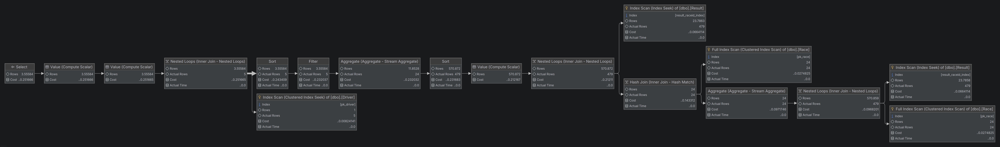

```sql
[2026-05-22 14:13:08] [S0000][3615] Table 'Driver'. Scan count 0, logical reads 10, physical reads 0, page server reads 0, read-ahead reads 0, page server read-ahead reads 0, lob logical reads 0, lob physical reads 0, lob page server reads 0, lob read-ahead reads 0, lob page server read-ahead reads 0.
[2026-05-22 14:13:08] [S0000][3615] Table 'Worktable'. Scan count 0, logical reads 0, physical reads 0, page server reads 0, read-ahead reads 0, page server read-ahead reads 0, lob logical reads 0, lob physical reads 0, lob page server reads 0, lob read-ahead reads 0, lob page server read-ahead reads 0.
[2026-05-22 14:13:08] [S0000][3615] Table 'Result'. Scan count 48, logical reads 98, physical reads 0, page server reads 0, read-ahead reads 0, page server read-ahead reads 0, lob logical reads 0, lob physical reads 0, lob page server reads 0, lob read-ahead reads 0, lob page server read-ahead reads 0.
[2026-05-22 14:13:08] [S0000][3615] Table 'Workfile'. Scan count 0, logical reads 0, physical reads 0, page server reads 0, read-ahead reads 0, page server read-ahead reads 0, lob logical reads 0, lob physical reads 0, lob page server reads 0, lob read-ahead reads 0, lob page server read-ahead reads 0.
[2026-05-22 14:13:08] [S0000][3615] Table 'Race'. Scan count 2, logical reads 68, physical reads 0, page server reads 0, read-ahead reads 0, page server read-ahead reads 0, lob logical reads 0, lob physical reads 0, lob page server reads 0, lob read-ahead reads 0, lob page server read-ahead reads 0.
[2026-05-22 14:13:08] [S0000][3612] SQL Server Execution Times:
[2026-05-22 14:13:08] CPU time = 1 ms,  elapsed time = 0 ms.
[2026-05-22 14:13:08] 5 rows retrieved starting from 1 in 327 ms (execution: 5 ms, fetching: 322 ms)
```

##### Alternatieve implementatie

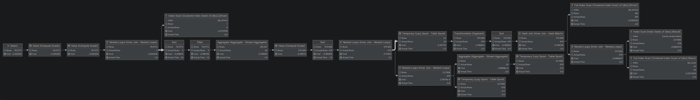

```sql
[2026-05-22 14:14:29] [S0000][3615] Table 'Driver'. Scan count 1, logical reads 36, physical reads 0, page server reads 0, read-ahead reads 0, page server read-ahead reads 0, lob logical reads 0, lob physical reads 0, lob page server reads 0, lob read-ahead reads 0, lob page server read-ahead reads 0.
[2026-05-22 14:14:29] [S0000][3615] Table 'Worktable'. Scan count 3, logical reads 1055, physical reads 0, page server reads 0, read-ahead reads 0, page server read-ahead reads 0, lob logical reads 0, lob physical reads 0, lob page server reads 0, lob read-ahead reads 0, lob page server read-ahead reads 0.
[2026-05-22 14:14:29] [S0000][3615] Table 'Workfile'. Scan count 0, logical reads 0, physical reads 0, page server reads 0, read-ahead reads 0, page server read-ahead reads 0, lob logical reads 0, lob physical reads 0, lob page server reads 0, lob read-ahead reads 0, lob page server read-ahead reads 0.
[2026-05-22 14:14:29] [S0000][3615] Table 'Result'. Scan count 24, logical reads 49, physical reads 0, page server reads 0, read-ahead reads 0, page server read-ahead reads 0, lob logical reads 0, lob physical reads 0, lob page server reads 0, lob read-ahead reads 0, lob page server read-ahead reads 0.
[2026-05-22 14:14:29] [S0000][3615] Table 'Race'. Scan count 1, logical reads 34, physical reads 0, page server reads 0, read-ahead reads 0, page server read-ahead reads 0, lob logical reads 0, lob physical reads 0, lob page server reads 0, lob read-ahead reads 0, lob page server read-ahead reads 0.
[2026-05-22 14:14:29] [S0000][3612] SQL Server Execution Times:
[2026-05-22 14:14:29] CPU time = 1 ms,  elapsed time = 1 ms.
[2026-05-22 14:14:29] 5 rows retrieved starting from 1 in 321 ms (execution: 7 ms, fetching: 314 ms)
```

### Index op `RaceId` van `DriverStanding`

Voor de evaluatie van deze index zal er gekeken worden naar het 7e vraagstuk.

#### Oorspronkelijke executieplannen en IO

##### Primaire implementatie


```sql
[2026-05-22 14:28:45] [S0000][3615] Table 'Constructor'. Scan count 0, logical reads 40, physical reads 1, page server reads 0, read-ahead reads 0, page server read-ahead reads 0, lob logical reads 0, lob physical reads 0, lob page server reads 0, lob read-ahead reads 0, lob page server read-ahead reads 0.
[2026-05-22 14:28:45] [S0000][3615] Table 'Driver'. Scan count 0, logical reads 40, physical reads 0, page server reads 0, read-ahead reads 0, page server read-ahead reads 0, lob logical reads 0, lob physical reads 0, lob page server reads 0, lob read-ahead reads 0, lob page server read-ahead reads 0.
[2026-05-22 14:28:45] [S0000][3615] Table 'Worktable'. Scan count 0, logical reads 0, physical reads 0, page server reads 0, read-ahead reads 0, page server read-ahead reads 0, lob logical reads 0, lob physical reads 0, lob page server reads 0, lob read-ahead reads 0, lob page server read-ahead reads 0.
[2026-05-22 14:28:45] [S0000][3615] Table 'Workfile'. Scan count 0, logical reads 0, physical reads 0, page server reads 0, read-ahead reads 0, page server read-ahead reads 0, lob logical reads 0, lob physical reads 0, lob page server reads 0, lob read-ahead reads 0, lob page server read-ahead reads 0.
[2026-05-22 14:28:45] [S0000][3615] Table 'Result'. Scan count 1, logical reads 327, physical reads 0, page server reads 0, read-ahead reads 0, page server read-ahead reads 0, lob logical reads 0, lob physical reads 0, lob page server reads 0, lob read-ahead reads 0, lob page server read-ahead reads 0.
[2026-05-22 14:28:45] [S0000][3615] Table 'Race'. Scan count 2, logical reads 39, physical reads 0, page server reads 0, read-ahead reads 0, page server read-ahead reads 0, lob logical reads 0, lob physical reads 0, lob page server reads 0, lob read-ahead reads 0, lob page server read-ahead reads 0.
[2026-05-22 14:28:45] [S0000][3615] Table 'DriverStanding'. Scan count 1, logical reads 199, physical reads 1, page server reads 0, read-ahead reads 190, page server read-ahead reads 0, lob logical reads 0, lob physical reads 0, lob page server reads 0, lob read-ahead reads 0, lob page server read-ahead reads 0.
[2026-05-22 14:28:45] [S0000][3612] SQL Server Execution Times:
[2026-05-22 14:28:45] CPU time = 4 ms,  elapsed time = 7 ms.
[2026-05-22 14:28:45] 20 rows retrieved starting from 1 in 369 ms (execution: 25 ms, fetching: 344 ms)
```

##### Alternatieve implementatie


```sql
[2026-05-22 14:29:03] [S0000][3615] Table 'Constructor'. Scan count 0, logical reads 40, physical reads 0, page server reads 0, read-ahead reads 0, page server read-ahead reads 0, lob logical reads 0, lob physical reads 0, lob page server reads 0, lob read-ahead reads 0, lob page server read-ahead reads 0.
[2026-05-22 14:29:03] [S0000][3615] Table 'Worktable'. Scan count 42, logical reads 165, physical reads 0, page server reads 0, read-ahead reads 0, page server read-ahead reads 0, lob logical reads 0, lob physical reads 0, lob page server reads 0, lob read-ahead reads 0, lob page server read-ahead reads 0.
[2026-05-22 14:29:03] [S0000][3615] Table 'Result'. Scan count 1, logical reads 747, physical reads 0, page server reads 0, read-ahead reads 0, page server read-ahead reads 0, lob logical reads 0, lob physical reads 0, lob page server reads 0, lob read-ahead reads 0, lob page server read-ahead reads 0.
[2026-05-22 14:29:03] [S0000][3615] Table 'Driver'. Scan count 0, logical reads 50, physical reads 0, page server reads 0, read-ahead reads 0, page server read-ahead reads 0, lob logical reads 0, lob physical reads 0, lob page server reads 0, lob read-ahead reads 0, lob page server read-ahead reads 0.
[2026-05-22 14:29:03] [S0000][3615] Table 'DriverStanding'. Scan count 1, logical reads 199, physical reads 0, page server reads 0, read-ahead reads 0, page server read-ahead reads 0, lob logical reads 0, lob physical reads 0, lob page server reads 0, lob read-ahead reads 0, lob page server read-ahead reads 0.
[2026-05-22 14:29:03] [S0000][3615] Table 'Race'. Scan count 1, logical reads 36, physical reads 0, page server reads 0, read-ahead reads 0, page server read-ahead reads 0, lob logical reads 0, lob physical reads 0, lob page server reads 0, lob read-ahead reads 0, lob page server read-ahead reads 0.
[2026-05-22 14:29:03] [S0000][3612] SQL Server Execution Times:
[2026-05-22 14:29:03] CPU time = 4 ms,  elapsed time = 4 ms.
[2026-05-22 14:29:03] 20 rows retrieved starting from 1 in 341 ms (execution: 15 ms, fetching: 326 ms)
```

#### Nieuwe executieplannen en IO & Onderbouwing Verschillen

##### Primaire implementatie

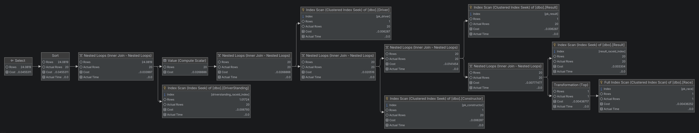

```sql
[2026-05-22 15:06:09] [S0000][3615] Table 'Worktable'. Scan count 0, logical reads 0, physical reads 0, page server reads 0, read-ahead reads 0, page server read-ahead reads 0, lob logical reads 0, lob physical reads 0, lob page server reads 0, lob read-ahead reads 0, lob page server read-ahead reads 0.
[2026-05-22 15:06:09] [S0000][3615] Table 'DriverStanding'. Scan count 20, logical reads 60, physical reads 0, page server reads 0, read-ahead reads 0, page server read-ahead reads 0, lob logical reads 0, lob physical reads 0, lob page server reads 0, lob read-ahead reads 0, lob page server read-ahead reads 0.
[2026-05-22 15:06:09] [S0000][3615] Table 'Driver'. Scan count 0, logical reads 40, physical reads 0, page server reads 0, read-ahead reads 0, page server read-ahead reads 0, lob logical reads 0, lob physical reads 0, lob page server reads 0, lob read-ahead reads 0, lob page server read-ahead reads 0.
[2026-05-22 15:06:09] [S0000][3615] Table 'Constructor'. Scan count 0, logical reads 40, physical reads 0, page server reads 0, read-ahead reads 0, page server read-ahead reads 0, lob logical reads 0, lob physical reads 0, lob page server reads 0, lob read-ahead reads 0, lob page server read-ahead reads 0.
[2026-05-22 15:06:09] [S0000][3615] Table 'Result'. Scan count 1, logical reads 43, physical reads 0, page server reads 0, read-ahead reads 0, page server read-ahead reads 0, lob logical reads 0, lob physical reads 0, lob page server reads 0, lob read-ahead reads 0, lob page server read-ahead reads 0.
[2026-05-22 15:06:09] [S0000][3615] Table 'Race'. Scan count 1, logical reads 5, physical reads 0, page server reads 0, read-ahead reads 0, page server read-ahead reads 0, lob logical reads 0, lob physical reads 0, lob page server reads 0, lob read-ahead reads 0, lob page server read-ahead reads 0.
[2026-05-22 15:06:09] [S0000][3612] SQL Server Execution Times:
[2026-05-22 15:06:09] CPU time = 0 ms,  elapsed time = 0 ms.
[2026-05-22 15:06:09] 20 rows retrieved starting from 1 in 318 ms (execution: 3 ms, fetching: 315 ms)
```

Een van de eerste en belangrijkste verschillen die zichtbaar is, is dat er na het toevoegen van de index in het 
executieplan op veel plaatsen geen gebruik meer wordt gemaakt van een *Full Index Scan*, maar in plaats daarvan van 
een veel efficiëntere *Index Scan*. Verder is bij de lookup van zowel entries uit de `DriverStanding`- als de 
`Result`-tabellen duidelijk te zien dat de index effect heeft gehad. In plaats van het uitlezen van tienduizenden 
rijen, worden nu in beide gevallen slechts enkele tientallen relevante rijen gelezen. Dit zorgt voor een drastische 
verlaging van zowel de kosten als de uitvoeringstijd.

De gevallen waarbij nog wel *Full Index Scan*-operators worden gebruikt, zijn niet relevant voor de huidige index en 
tonen daarom ook niet de effectiviteit ervan aan. De onderdelen waarbij deze index wél relevant is, laten daarentegen 
aanzienlijke verbeteringen zien, waaruit geconcludeerd kan worden dat de index effectief is.

Verder is te zien dat er meer gebruik wordt gemaakt van *Nested Loop*-operators in plaats van *Hash Join*-operators. 
In dit geval is dat een positief teken, omdat de indexen effectief genoeg zijn om een *Hash Join* overbodig te maken; 
een eenvoudige loop-constructie blijkt hier sneller te zijn.

Tot slot laten ook de IO- en tijdsstatistieken duidelijk verschillen zien. De CPU-tijd is aanzienlijk lager geworden en 
zowel de `DriverStanding`- als de `Result`-tabel hebben een veel lager aantal *logical reads*. Daarnaast is ook het 
aantal *physical reads* afgenomen. Hoewel dit aantal eerder al laag was, is het nu teruggebracht van enkele reads 
naar nul.

Wel is het belangrijk om te vermelden dat, door de aanwezigheid van een andere index op `DriverStanding`, de 
optimalisatie niet uitsluitend wordt veroorzaakt door de index op `Result`. Omdat de lookup op `Result` echter
aanzienlijk efficiënter verloopt, kan alsnog geconcludeerd worden dat deze index effectief is. Tegelijkertijd kan ook 
de index op `DriverStanding` in deze situatie als effectief worden beschouwd.


##### Alternatieve implementatie

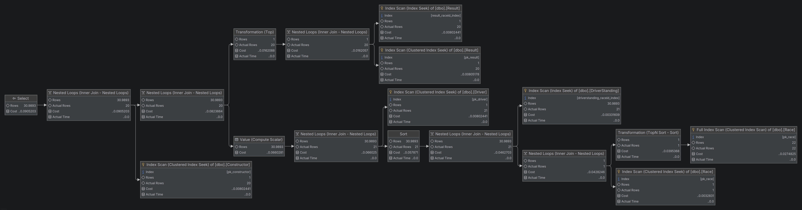

```sql
[2026-05-22 15:06:28] [S0000][3615] Table 'Constructor'. Scan count 0, logical reads 40, physical reads 0, page server reads 0, read-ahead reads 0, page server read-ahead reads 0, lob logical reads 0, lob physical reads 0, lob page server reads 0, lob read-ahead reads 0, lob page server read-ahead reads 0.
[2026-05-22 15:06:28] [S0000][3615] Table 'Result'. Scan count 21, logical reads 82, physical reads 0, page server reads 0, read-ahead reads 0, page server read-ahead reads 0, lob logical reads 0, lob physical reads 0, lob page server reads 0, lob read-ahead reads 0, lob page server read-ahead reads 0.
[2026-05-22 15:06:28] [S0000][3615] Table 'Driver'. Scan count 0, logical reads 50, physical reads 0, page server reads 0, read-ahead reads 0, page server read-ahead reads 0, lob logical reads 0, lob physical reads 0, lob page server reads 0, lob read-ahead reads 0, lob page server read-ahead reads 0.
[2026-05-22 15:06:28] [S0000][3615] Table 'Worktable'. Scan count 0, logical reads 0, physical reads 0, page server reads 0, read-ahead reads 0, page server read-ahead reads 0, lob logical reads 0, lob physical reads 0, lob page server reads 0, lob read-ahead reads 0, lob page server read-ahead reads 0.
[2026-05-22 15:06:28] [S0000][3615] Table 'DriverStanding'. Scan count 1, logical reads 3, physical reads 0, page server reads 0, read-ahead reads 0, page server read-ahead reads 0, lob logical reads 0, lob physical reads 0, lob page server reads 0, lob read-ahead reads 0, lob page server read-ahead reads 0.
[2026-05-22 15:06:28] [S0000][3615] Table 'Race'. Scan count 1, logical reads 36, physical reads 0, page server reads 0, read-ahead reads 0, page server read-ahead reads 0, lob logical reads 0, lob physical reads 0, lob page server reads 0, lob read-ahead reads 0, lob page server read-ahead reads 0.
[2026-05-22 15:06:28] [S0000][3612] SQL Server Execution Times:
[2026-05-22 15:06:28] CPU time = 0 ms,  elapsed time = 0 ms.
[2026-05-22 15:06:28] 20 rows retrieved starting from 1 in 328 ms (execution: 11 ms, fetching: 317 ms)
```

Voor de alternatieve implementatie geld een vergelijkbare uitleg, ook hier is te zien hoe diverse *Full Index Scan*
operators vervangen worden met betere *Index Scan* operators; waardoor het aantal rijen drastisch verminderd wordt,
tegelijkertijd ook weer de kosten en tijd.

Verder is ook bij deze implementatie wederom een enorme verbetering te zien in de IO en tijd statistieken. Het aantal
logical reads is drastisch lager, het aantal scans gehalveerd en de CPU tijd enorm laag geworden. Ook bij deze
implementatie is dus het effect van de index enorm duidelijk.

#### Verandering voorkeur met onderbouwing

Waarbij de oorspronkelijke voorkeur lag bij de alternatieve implementatie, die een *Full Index Scan* van de `Result`
tabel wist te voorkomen (hierdoor gebruikte deze veel minder rijen dan de primaire implementatie), is de vergelijking
nu wat moeilijker, beide hebben een fantastische performance, en komen ongeveer uit op ~200 logical reads in totaal,
met een CPU tijd van zo goed als nul. Echter, is het primaire executieplan nu wel iets beter, hij heeft namelijk ~30
logical reads minder, en bestaat uit een simpeler plan. Ook heeft het primaire plan een simpelere werking, door middel
van joins en geen `CROSS APPLY`, wat het voor toekomstige ontwikkelaars ook makkelijker maakt.

Met deze reden, is de voorkeur veranderd naar de primaire implementatie, deze is net iets mooier en simpeler (zowel in
code als executieplan), het aantal logical reads ligt ook net iets lager.

### Index op `RaceId` en `FastestLapTime` van `Result`

Voor de evaluatie van deze index zal er naar de 2e bevraging gekeken worden. Dit is verder ook de enige 
bevraging waarop deze index van toepassing is (op basis van de aanbevelingen van SQL-server).

##### Primaire implementatie


```sql
[2026-05-22 15:01:30] [S0000][3615] Table 'Worktable'. Scan count 412, logical reads 54960, physical reads 0, page server reads 0, read-ahead reads 0, page server read-ahead reads 0, lob logical reads 0, lob physical reads 0, lob page server reads 0, lob read-ahead reads 0, lob page server read-ahead reads 0.
[2026-05-22 15:01:30] [S0000][3615] Table 'Result'. Scan count 1, logical reads 1181, physical reads 0, page server reads 0, read-ahead reads 0, page server read-ahead reads 0, lob logical reads 0, lob physical reads 0, lob page server reads 0, lob read-ahead reads 0, lob page server read-ahead reads 0.
[2026-05-22 15:01:30] [S0000][3615] Table 'Race'. Scan count 2, logical reads 68, physical reads 0, page server reads 0, read-ahead reads 0, page server read-ahead reads 0, lob logical reads 0, lob physical reads 0, lob page server reads 0, lob read-ahead reads 0, lob page server read-ahead reads 0.
[2026-05-22 15:01:30] [S0000][3615] Table 'Driver'. Scan count 1, logical reads 21, physical reads 0, page server reads 0, read-ahead reads 0, page server read-ahead reads 0, lob logical reads 0, lob physical reads 0, lob page server reads 0, lob read-ahead reads 0, lob page server read-ahead reads 0.
[2026-05-22 15:01:30] [S0000][3615] Table 'ResultStatus'. Scan count 1, logical reads 3, physical reads 0, page server reads 0, read-ahead reads 0, page server read-ahead reads 0, lob logical reads 0, lob physical reads 0, lob page server reads 0, lob read-ahead reads 0, lob page server read-ahead reads 0.
[2026-05-22 15:01:30] [S0000][3615] Table 'Circuit'. Scan count 1, logical reads 5, physical reads 0, page server reads 0, read-ahead reads 0, page server read-ahead reads 0, lob logical reads 0, lob physical reads 0, lob page server reads 0, lob read-ahead reads 0, lob page server read-ahead reads 0.
[2026-05-22 15:01:30] [S0000][3612] SQL Server Execution Times:
[2026-05-22 15:01:30] CPU time = 27 ms,  elapsed time = 27 ms.
[2026-05-22 15:01:30] 410 rows retrieved starting from 1 in 350 ms (execution: 32 ms, fetching: 318 ms)
```

##### Alternatieve implementatie


```sql
[2026-05-22 15:01:43] [S0000][3615] Table 'Worktable'. Scan count 0, logical reads 0, physical reads 0, page server reads 0, read-ahead reads 0, page server read-ahead reads 0, lob logical reads 0, lob physical reads 0, lob page server reads 0, lob read-ahead reads 0, lob page server read-ahead reads 0.
[2026-05-22 15:01:43] [S0000][3615] Table 'Workfile'. Scan count 0, logical reads 0, physical reads 0, page server reads 0, read-ahead reads 0, page server read-ahead reads 0, lob logical reads 0, lob physical reads 0, lob page server reads 0, lob read-ahead reads 0, lob page server read-ahead reads 0.
[2026-05-22 15:01:43] [S0000][3615] Table 'Result'. Scan count 1, logical reads 327, physical reads 0, page server reads 0, read-ahead reads 0, page server read-ahead reads 0, lob logical reads 0, lob physical reads 0, lob page server reads 0, lob read-ahead reads 0, lob page server read-ahead reads 0.
[2026-05-22 15:01:43] [S0000][3615] Table 'Race'. Scan count 2, logical reads 68, physical reads 0, page server reads 0, read-ahead reads 0, page server read-ahead reads 0, lob logical reads 0, lob physical reads 0, lob page server reads 0, lob read-ahead reads 0, lob page server read-ahead reads 0.
[2026-05-22 15:01:43] [S0000][3615] Table 'Driver'. Scan count 1, logical reads 22, physical reads 0, page server reads 0, read-ahead reads 0, page server read-ahead reads 0, lob logical reads 0, lob physical reads 0, lob page server reads 0, lob read-ahead reads 0, lob page server read-ahead reads 0.
[2026-05-22 15:01:43] [S0000][3615] Table 'ResultStatus'. Scan count 1, logical reads 3, physical reads 0, page server reads 0, read-ahead reads 0, page server read-ahead reads 0, lob logical reads 0, lob physical reads 0, lob page server reads 0, lob read-ahead reads 0, lob page server read-ahead reads 0.
[2026-05-22 15:01:43] [S0000][3615] Table 'Circuit'. Scan count 1, logical reads 5, physical reads 0, page server reads 0, read-ahead reads 0, page server read-ahead reads 0, lob logical reads 0, lob physical reads 0, lob page server reads 0, lob read-ahead reads 0, lob page server read-ahead reads 0.
[2026-05-22 15:01:43] [S0000][3612] SQL Server Execution Times:
[2026-05-22 15:01:43] CPU time = 4 ms,  elapsed time = 6 ms.
[2026-05-22 15:01:43] 410 rows retrieved starting from 1 in 351 ms (execution: 14 ms, fetching: 337 ms)
```

#### Nieuwe executieplannen en IO

##### Primaire implementatie

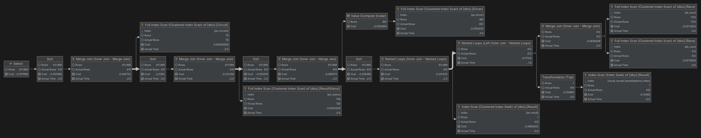

```sql
[2026-05-22 15:04:11] [S0000][3615] Table 'Worktable'. Scan count 0, logical reads 0, physical reads 0, page server reads 0, read-ahead reads 0, page server read-ahead reads 0, lob logical reads 0, lob physical reads 0, lob page server reads 0, lob read-ahead reads 0, lob page server read-ahead reads 0.
[2026-05-22 15:04:11] [S0000][3615] Table 'Result'. Scan count 412, logical reads 1748, physical reads 0, page server reads 0, read-ahead reads 0, page server read-ahead reads 0, lob logical reads 0, lob physical reads 0, lob page server reads 0, lob read-ahead reads 0, lob page server read-ahead reads 0.
[2026-05-22 15:04:11] [S0000][3615] Table 'Race'. Scan count 2, logical reads 68, physical reads 0, page server reads 0, read-ahead reads 0, page server read-ahead reads 0, lob logical reads 0, lob physical reads 0, lob page server reads 0, lob read-ahead reads 0, lob page server read-ahead reads 0.
[2026-05-22 15:04:11] [S0000][3615] Table 'Driver'. Scan count 1, logical reads 21, physical reads 0, page server reads 0, read-ahead reads 0, page server read-ahead reads 0, lob logical reads 0, lob physical reads 0, lob page server reads 0, lob read-ahead reads 0, lob page server read-ahead reads 0.
[2026-05-22 15:04:11] [S0000][3615] Table 'ResultStatus'. Scan count 1, logical reads 3, physical reads 0, page server reads 0, read-ahead reads 0, page server read-ahead reads 0, lob logical reads 0, lob physical reads 0, lob page server reads 0, lob read-ahead reads 0, lob page server read-ahead reads 0.
[2026-05-22 15:04:11] [S0000][3615] Table 'Circuit'. Scan count 1, logical reads 5, physical reads 0, page server reads 0, read-ahead reads 0, page server read-ahead reads 0, lob logical reads 0, lob physical reads 0, lob page server reads 0, lob read-ahead reads 0, lob page server read-ahead reads 0.
[2026-05-22 15:04:11] [S0000][3612] SQL Server Execution Times:
[2026-05-22 15:04:11] CPU time = 4 ms,  elapsed time = 3 ms.
[2026-05-22 15:04:11] 410 rows retrieved starting from 1 in 335 ms (execution: 6 ms, fetching: 329 ms)
```

##### Alternatieve implementatie

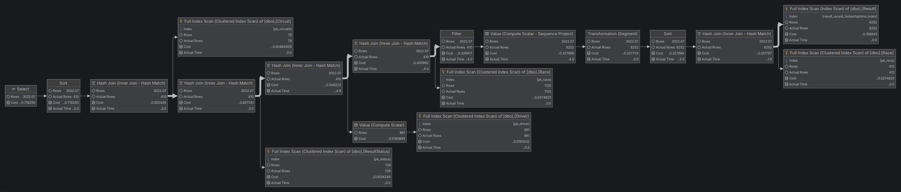

```sql
[2026-05-22 15:03:48] [S0000][3615] Table 'Worktable'. Scan count 0, logical reads 0, physical reads 0, page server reads 0, read-ahead reads 0, page server read-ahead reads 0, lob logical reads 0, lob physical reads 0, lob page server reads 0, lob read-ahead reads 0, lob page server read-ahead reads 0.
[2026-05-22 15:03:48] [S0000][3615] Table 'Workfile'. Scan count 0, logical reads 0, physical reads 0, page server reads 0, read-ahead reads 0, page server read-ahead reads 0, lob logical reads 0, lob physical reads 0, lob page server reads 0, lob read-ahead reads 0, lob page server read-ahead reads 0.
[2026-05-22 15:03:48] [S0000][3615] Table 'Result'. Scan count 1, logical reads 173, physical reads 0, page server reads 0, read-ahead reads 0, page server read-ahead reads 0, lob logical reads 0, lob physical reads 0, lob page server reads 0, lob read-ahead reads 0, lob page server read-ahead reads 0.
[2026-05-22 15:03:48] [S0000][3615] Table 'Race'. Scan count 2, logical reads 68, physical reads 0, page server reads 0, read-ahead reads 0, page server read-ahead reads 0, lob logical reads 0, lob physical reads 0, lob page server reads 0, lob read-ahead reads 0, lob page server read-ahead reads 0.
[2026-05-22 15:03:48] [S0000][3615] Table 'Driver'. Scan count 1, logical reads 22, physical reads 0, page server reads 0, read-ahead reads 0, page server read-ahead reads 0, lob logical reads 0, lob physical reads 0, lob page server reads 0, lob read-ahead reads 0, lob page server read-ahead reads 0.
[2026-05-22 15:03:48] [S0000][3615] Table 'ResultStatus'. Scan count 1, logical reads 3, physical reads 0, page server reads 0, read-ahead reads 0, page server read-ahead reads 0, lob logical reads 0, lob physical reads 0, lob page server reads 0, lob read-ahead reads 0, lob page server read-ahead reads 0.
[2026-05-22 15:03:48] [S0000][3615] Table 'Circuit'. Scan count 1, logical reads 5, physical reads 0, page server reads 0, read-ahead reads 0, page server read-ahead reads 0, lob logical reads 0, lob physical reads 0, lob page server reads 0, lob read-ahead reads 0, lob page server read-ahead reads 0.
[2026-05-22 15:03:48] [S0000][3612] SQL Server Execution Times:
[2026-05-22 15:03:48] CPU time = 6 ms,  elapsed time = 5 ms.
[2026-05-22 15:03:48] 410 rows retrieved starting from 1 in 329 ms (execution: 10 ms, fetching: 319 ms)
```